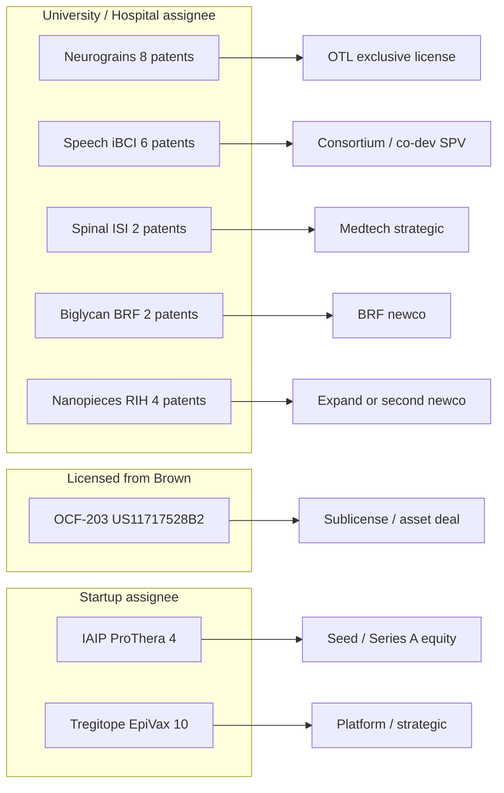

# Rhode Island Life Sciences: Citation-Backed Diligence & Investment Report

**Audience:** Early-stage investors, scientific and clinical experts, and operator diligence teams.  
**Version:** 2.1 (June 2026)  
**Primary evidence:** Amass BiomedCore (PubMed-derived) and TrialCore (ClinicalTrials.gov-derived), with PMIDs and NCT IDs cited throughout.  
**Patent evidence:** 57 discrete filings in `data/ri_patents_curated.json`; **12 patent-defined investable assets** scored in `data/ri_patent_investment_opportunities.json` (Section 4). Many targets are **IP-centric** (Brown OTL, Brown Research Foundation, Rhode Island Hospital) and **grant-supported** without a discrete incorporated entity. Live PPUBS harvest deferred due to HTTP 429; validate with `scripts/ri_patent_harvest.py` and MCP `uspto-patents` when available.  
**Grant evidence:** NIH/VA RePORTER API harvest in `data/ri_grants_nih.json` plus curated non-federal awards in `data/ri_funding_matrix.json` (DARPA, NSF/COBRE, state, venture). Dollar amounts are public obligations where reported; always confirm active status in [RePORTER](https://reporter.nih.gov).

**Disclaimer:** This document is research synthesis, not investment advice, legal opinion, or clinical guidance. Retracted or preprint literature is flagged where material to diligence. Company status and trial enrollment change frequently—verify before term sheets.

---

## Table of contents

1. [Executive summary](#1-executive-summary)
2. [Methodology & reproducibility](#2-methodology--reproducibility)
3. [Rhode Island ecosystem map](#3-rhode-island-ecosystem-map)
4. [Patent-centric investment opportunities](#4-patent-centric-investment-opportunities)
5. [Investment themes (diligence by vertical)](#5-investment-themes-diligence-by-vertical)
6. [Rhode Island experts for diligence calls](#6-rhode-island-experts-for-diligence-calls)
7. [Patent–funding correlation matrix](#7-patentfunding-correlation-matrix)
8. [Federal and non-federal funding by project](#8-federal-and-non-federal-funding-by-project)
9. [Patent annex (57 filings)](#9-patent-annex-57-filings)
10. [Clinical trial landscape (selected)](#10-clinical-trial-landscape-selected)
11. [Risks, gaps, and next diligence steps](#11-risks-gaps-and-next-diligence-steps)

---

## 1. Executive summary

Rhode Island’s life-science investable surface clusters around **Brown University / Warren Alpert Medical School**, **Brown University Health** (Rhode Island Hospital, The Miriam Hospital, Women & Infants), and a **Providence-centric startup belt** (EpiVax, Ocean Biomedical, SMURF-Therapeutics, NanoDe, Nabsys, ProThera, Volta Medical, Neurotech). Manufacturing anchors (Amgen West Greenwich, Alexion Smithfield) are mature employers rather than seed-stage venture targets.

**IP-first framing (v2.1).** Of **57** curated patent filings, **12** map to discrete **patent-defined investable assets** ([Section 4](#4-patent-centric-investment-opportunities)). **Seven** are primarily **university or hospital assignees** (Brown, Brown Research Foundation, Rhode Island Hospital) where the natural transaction is **OTL/BRF license, field-of-use sublicense, or newco formation**—not equity in an existing RI startup. **Three** high-priority academic packages—**wireless neurograins**, **speech/tablet iBCI**, and **intelligent spinal interface**—account for **~17** Brown filings and **>$25M** in cited federal non-dilutive support (DARPA + NIH/VA). Grant-only themes (SMURF2, SOMA, Christensen epigenetics, Levine wearables) remain investable via **researcher-enabled spinouts** but are flagged as **patent gaps** until assignee harvest completes.

### Prioritized early-stage opportunities (patent + grant correlated)

| Rank | Theme | Patents | Notable federal / other funding | Near-term path |
|------|--------|--------:|--------------------------------|----------------|
| **1** | Immunoinformatics (EpiVax) | 10 | NIH SBIR/U01 e.g. **R43AI174486**, **U01FD007760**, **R01AI132205** | Platform ARR + therapeutics |
| **2** | Chitinase antifibrosis | 1 | NHLBI **P01HL114501** (Elias); Ocean portfolio grants (verify OCF-203 license) | IND / ILD sites |
| **3** | Nanopieces RNA (NanoDe) | 4 | STTR **R41TR002298**; RI COBRE / Life Science Hub | Ortho or CNS pilot |
| **4a** | Speech/tablet iBCI | 6+ | NIDCD **U01DC017844**; VA **I01RX004820**, **I01RX002295** | BrainGate trials |
| **4b** | Wireless neurograins | 8+ | NINDS **UH2NS095548**; DARPA **~$19M** neurograins | License / CINNR |
| **4c** | Spinal interface (ISI) | 2+ | DARPA **$6.3M** ISI; **NCT04302259** | SCI rehab device |
| **5** | SMURF2 oncology | 0* | NCI **R01CA173453**; SMURF-Tx NIH submission 2024 | Biomarker combos |
| **6** | SOMA pain DTx | 0* | COBRE **P20GM103645** pilots; Carney innovation award | FDA DTx / payer |
| **7** | IAIP neonatal sepsis | 4 | **R44AI141283**, **R44NS084575** (~$2.8M track) | LFIA + NICU |
| **8** | TME epigenetics | 0* | NCI **R01CA216265**, **R01CA253976** | HiTIMED license |
| **9** | Pediatric sepsis ML | 0* | FIC **R33TW012211**; NIDDK **R01DK116163** | LMIC → US CDSS |
| **10** | Genomics (Nabsys) | 3 | NHGRI **R43HG004433**; $1000 Genome program | Commercial OhmX |
| **11** | AF AI (Volta) | 2 | VC **~$74M** (not NIH) | SaMD expansion |
| **12** | Ophthalmology ECT | 8 | Mature Neurotech (historical NEI) | Royalty / M&A |
| **13** | Biglycan MSK | 2 | Grant linkage TBD (Fallon) | Rare disease BD |

\*Patents not yet in curated annex for this theme; expand assignee/inventor harvest.

Patent-first diligence cards: [Section 4](#4-patent-centric-investment-opportunities). Full grant tables: [Section 8](#8-federal-and-non-federal-funding-by-project).

### Cross-cutting diligence themes

- **Translation:** Brown OTL, Rhode Island Foundation, RI Life Science Hub, Ocean State Labs incubator cohort (MindImmune, OncoLux, P53 Therapeutics, Pax, XM). **IP-first targets** are catalogued in [Section 4](#4-patent-centric-investment-opportunities)—seven academic/hospital assignee packages do not require an existing startup.
- **Clinical access:** Lifespan Cancer Institute (WIN consortium), Center for Advanced Lung Care / ILD program (fibrosis), Women & Infants perinatal trials, BrainGate at Rhode Island Hospital and MA sites.
- **Reimbursement:** Volta (FDA-cleared AF mapping); SOMA (consumer/research app—payer path immature); EpiVax (B2B/services + therapeutics spinout).

---

## 2. Methodology & reproducibility

### Literature and trials (Amass)

- BiomedCore searches by **author**, **institution**, and **topic** with `minJournalQualityJufo` where noted.
- TrialCore searches by **facility**, **sponsor**, and **condition**; verify site lists on ClinicalTrials.gov before assuming RI enrollment.

### Patents

- Curated set: `data/ri_patents_curated.json` (57 unique numbers, June 2026).
- **IP-first opportunity registry:** `data/ri_patent_investment_opportunities.json` (12 patent-defined assets + 3 grant gaps).
- Rate-limited live harvest: `docs/RATE_LIMITED_RESEARCH.md`, `scripts/ri_patent_harvest.py`.
- **Do not** bulk-fetch claims via MCP; use `ppubs_get_patent_by_number` on ≤10 priority assets per diligence cycle.

### Web / company resolution

- Entity names, HQ, and public listings cross-checked via web search (BioPharmGuy RI directory, press releases, Brown Health provider pages). **Mock or inferred financials are not used.**

### Grants and non-dilutive capital

- **NIH/VA:** `python3 scripts/fetch_nih_grants.py` → `data/ri_grants_nih.json` (RePORTER API v2).
- **Curated matrix:** `data/ri_funding_matrix.json` maps **16 investment themes** to patents + NIH/VA/DARPA/NSF(COBRE)/state/VC rows with URLs.
- **Refresh:** Re-run fetch script quarterly; add NSF Award Search and SAM.gov for SBIR Phase III manually.

### Citation format

- Publications: `PMID` + DOI link.
- Trials: `NCT` ID.
- Patents: US/WO number; independent claims require MCP or USPTO PDF review.
- Grants: project number (e.g. `R44AI141283`) + [RePORTER](https://reporter.nih.gov) or primary press/SBIR URL.

---

## 3. Rhode Island ecosystem map

### Companies (Providence and statewide)

| Company | Location | Focus | Diligence note |
|---------|----------|-------|----------------|
| [EpiVax](https://epivax.com) | Providence | iVAX, Tregitope, ISPRI | Mature platform; PMID [32318055](https://doi.org/10.3389/fimmu.2020.00442) |
| EpiVax Therapeutics | Providence | Oncology immunotherapy spinout | Pipeline stage—verify IND status |
| [Ocean Biomedical](https://oceanbiomedical.com) (OCEA) | Providence | Elias fibrosis assets (Chit1/OCF-203) | Public; US11717528B2 |
| Elkurt Therapeutics | RI-linked | 18 glycosyl hydrolase family (Elias co-founder) | Private; parallel to Ocean |
| [SMURF-Therapeutics](https://smurftherapeutics.com) | Providence | Smurf2 modulators (El-Deiry) | Preclinical; founded 2021 |
| [NanoDe Therapeutics](https://nanodetherapeutics.com) | Providence | Nanopieces RNA delivery | RIH/Brown license; RI Life Science Hub award |
| [Nabsys 2.0](https://www.nabsys.com) | Providence | Electronic genome mapping | Hitachi majority interest |
| [ProThera Biologics](https://www.protherabiologics.com) | Providence area | IAIP sepsis/NEC | RIH/Women & Infants collaborations |
| [Volta Medical](https://www.volta-medical.us) | Providence | AI AF ablation (VX1) | FDA-cleared; US10750967B2 |
| [Neurotech Pharmaceuticals](https://www.neurotechpharmaceuticals.com) | Cumberland | Encapsulated cell therapy (CNTF) | Late-stage ophthalmology |
| [BrainGate](https://www.braingate.org) | Brown + RI Hospital | iBCI clinical trials | NCT00912041 family |
| [MindImmune](https://mindimmune.com) | Kingston | Neuroinflammation | Ocean State Labs cohort |
| [Bolden Therapeutics](https://biopharmguy.com/links/state-ri-all-geo.php) | Providence | ASO neuro | CNS |
| [ni2o](https://biopharmguy.com/links/state-ri-all-geo.php) | Providence | BCI | Overlaps BrainGate |
| Amgen / Alexion | West Greenwich / Smithfield | Biologics manufacturing | Anchor employers |

### Institutions

- **Brown University** — Alpert Medical School, Carney Institute (computational psychiatry), School of Engineering (Borton, Nurmikko).
- **Brown University Health** — Rhode Island Hospital, Miriam, Women & Infants; [Center for Advanced Lung Care](https://www.brownhealth.org/centers-services/center-advanced-lung-care).
- **Lifespan / Cancer Institute** — WIN (Wafik El-Deiry network), oncology trials.
- **VA Medical Center, Providence** — BrainGate site.

---

## 4. Patent-centric investment opportunities

Most RI life-science value is **not** captured by counting incorporated companies alone. **Brown University** holds **23** of **57** curated filings; **Rhode Island Hospital** and **Brown Research Foundation (BRF)** hold hospital- and muscle-regeneration estates. Federal and DARPA awards often flow to **PIs and consortia** (BrainGate, Nurmikko neurograins, Borton spinal interface) while commercialization rights sit in **OTL invention disclosures and patent families**.

**Machine-readable registry:** `data/ri_patent_investment_opportunities.json` — **12** scored assets plus **3** grant-supported gaps pending patent harvest.

### 4.1 How patents define the investable unit

| Dimension | What to diligence |
|-----------|-------------------|
| **Assignee** | University vs hospital vs BRF vs startup vs public licensee |
| **Cluster depth** | Continuation families (e.g., 10× Tregitope, 8× wireless neurotech) |
| **Grant stack** | Active SBIR/STTR/R01/U01/DARPA/VA tied to same inventors |
| **Vehicle** | Exclusive license, spinout, consortium sublicense, SPV asset purchase, royalty |
| **Encumbrance** | Existing exclusive license (Ocean/OCF-203), trial consortium terms, Hitachi/Nabsys |

**Promise tier (A / B / C)** in the tables below combines patent cluster depth, federal funding signal, and clarity of a transaction path—not a valuation or recommendation.

### 4.2 Priority patent-defined assets (ranked)

| Rank | Asset ID | Title | Tier | Patents (n) | Assignee | Vehicle | Existing entity | Federal anchor |
|------|----------|-------|------|------------:|----------|---------|-----------------|----------------|
| 1 | `ip_wireless_neurograins` | Wireless neurograins & distributed cortical implants | **A** | 8 | Brown | OTL license / spinout | — | DARPA ~$19M; UH2NS095548 |
| 2 | `ip_speech_tablet_ibci` | Speech decoding & multi-device tablet iBCI | **A** | 6 | Brown | Consortium / device co-dev | BrainGate | U01DC017844; VA I01 |
| 3 | `ip_nanopieces_rna` | Nanopieces non-viral RNA delivery | **A** | 4 | RIH | License / expand NanoDe | NanoDe | R41TR002298; COBRE |
| 4 | `ip_chitinase_ocf203` | Chitinase-1 antifibrosis (OCF-203) | **A** | 1 | Licensed (Ocean) | Sublicense / newco / asset | Ocean; Elkurt | P01HL114501 |
| 5 | `ip_iaip_neonatal` | IAIP biologics & sepsis/NEC LFIA | **A** | 4 | ProThera | Equity | ProThera | R44AI141283; R44NS084575 |
| 6 | `ip_spinal_isi_dbs` | Intelligent spinal interface & closed-loop DBS | **A** | 2 | Brown | Medtech license / SPV | — | DARPA $6.3M; NCT04302259 |
| 7 | `ip_tregitope_immunomod` | Tregitope regulatory epitope therapeutics | **B** | 10 | EpiVax | Platform / spinout equity | EpiVax | SBIR/U01 stack |
| 8 | `ip_biglycan_msk` | Biglycan MSK / neuromuscular regeneration | **B** | 2 | BRF | OTL newco | — | Grant linkage TBD |
| 9 | `ip_neural_decoding_legacy` | Core BMI decoding & cortical interface | **B** | 5 | Brown | Field-of-use / royalty | BrainGate | Multi-IC |
| 10 | `ip_af_mapping_ai` | AI AF ablation mapping (VX1) | **B** | 2 | Volta | Growth / strategic | Volta | VC ~$74M |
| 11 | `ip_genomics_hans` | HANS / electronic genome mapping | **C** | 3 | Nabsys | Strategic M&A | Nabsys 2.0 | R43HG004433 |
| 12 | `ip_ect_ophthalmology` | Encapsulated cell therapy (CNTF) | **C** | 8 | Neurotech | Royalty / M&A | Neurotech | Historical NEI |

**Tier A (6 assets):** Best fit for **formation capital, OTL-exclusive license, or asset SPV**—strong patent anchor plus active grants and/or recruiting trials. **Four** are **academic/hospital-primary** (rows 1–2, 4, 6); **one** is hospital IP with startup optionality (row 3); **one** is startup-held but grant-de-risked (row 5).

**Tier B (4 assets):** Platform, BRF out-license, legacy decoding stack, or growth SaMD—still patent-material but different check size and risk.

**Tier C (2 assets):** Mature assignees; patents support **secondary liquidity**, not classic seed.

### 4.3 Academic & hospital packages (no required startup)

These opportunities are **researcher-enabled** and **patent-anchored**; investors typically structure through **Brown OTL**, **RIH licensing**, or a **newco** rather than assuming an existing RI C-corp.

#### Wireless neurograins (`ip_wireless_neurograins`)

- **Patents:** US10433754B2 (implantable wireless neural device); US11464964B2 (distributed wireless nodes); WO2016187254A1 / WO2020018571A1 (chiplet intranet); US20200367749A1 (microscale sensor network); US20200229704A1 (optoelectronic read/write).
- **Inventors:** Nurmikko, Borton, Rosenstein, Mercier, Asbeck.
- **Non-dilutive:** DARPA neurograins up to **~$19M**; NIH UH2NS095548 (~$2.0M).
- **Thesis:** Replace tethered arrays with scalable wireless nodes—distinct from speech/tablet decoding IP (Section 5.6).
- **Comparable diligence:** Paradromics, Neuralink interface programs (FTO vs Brown family); Blackrock does not own wireless grain stack.
- **Transaction:** Exclusive field-of-use license to medtech or BCI hardware newco; verify OTL encumbrances vs BrainGate consortium.

#### Speech & tablet iBCI (`ip_speech_tablet_ibci`)

- **Patents:** US12042303 (speech communication); US11972050 (multi-device BCI); US12561001 (high-accuracy element selection); US10448877B2 (neurological event prediction); US18946156 (sustained grasp commands).
- **Inventors:** Hochberg, Simeral, Hosman, Goldberg, Vargas-Irwin.
- **Clinical:** NCT05724173, NCT06094205, NCT06511934 (recruiting).
- **Non-dilutive:** U01DC017844; VA I01RX004820, I01RX002295.
- **Thesis:** Human speech/tablet data and decoding algorithms are licensable **separately** from implant vendor—consortium or SaaS/device wrapper SPV.
- **RI experts:** Hochberg, Simeral; VA CfNN (Providence).

#### Nanopieces RNA (`ip_nanopieces_rna`)

- **Patents:** US11701094B2, US11608340B2, US12357635B2, US20230183253A1 — all **Rhode Island Hospital** assignee, Chen inventor.
- **Non-dilutive:** STTR R41TR002298; orthopedics COBRE P20GM104416; RI Life Science Hub Growth Catalyst.
- **Thesis:** Hospital-owned delivery platform; [NanoDe](https://nanodetherapeutics.com) is one licensee path—additional fields (CNS, fibrosis payload) may support **second newco** or expanded license.
- **Caution:** RePORTER PI name collisions for “Chen Qian”—anchor diligence on **R41TR002298** and RIH OTL file.

#### Chitinase / OCF-203 (`ip_chitinase_ocf203`)

- **Patent:** US11717528B2 — Chitinase 1 inhibition for fibrosis (Elias, Brown origin).
- **Non-dilutive:** NHLBI P01HL114501 (active Elias engine).
- **Thesis:** Single flagship filing in curated set; economics depend on **license chain** (Ocean Biomedical, Elkurt, or re-licensed newco). **Mandatory:** confirm OCF-203 sublicense status post-2025 press.
- **Clinical access:** Brown Health Center for Advanced Lung Care / ILD program.

#### Intelligent spinal interface (`ip_spinal_isi_dbs`)

- **Patents:** WO2019027517A1 (effortful mental task DBS facilitation); US20170042713A1 (mobile medical monitoring — Borton/Nurmikko/Simeral).
- **Non-dilutive:** DARPA ISI **$6.3M**; NCT04302259 IDE at RIH.
- **Thesis:** SCI + bladder rehabilitation device path—**medtech strategic** or hospital-aligned SPV, not cortical BCI competitor.

#### Biglycan regeneration (`ip_biglycan_msk`)

- **Patents:** US8658596B2, US20110183910A1 — **Brown University Research Foundation**, Fallon inventor.
- **Thesis:** Rare neuromuscular / MSK package with **no RI startup** in ecosystem map—archetypal **BRF → OTL → newco** opportunity.
- **Gap:** Active NIH awards on Fallon program not harvested—add RePORTER PI search.

### 4.4 Company-held but IP-material packages

| Asset | Why patents still define diligence | Key numbers |
|-------|-----------------------------------|-------------|
| **IAIP / ProThera** | Four-filing estate covers composition, treatment method, reissue | US7932365B2, US9572872B2, USRE47972E1 |
| **Tregitope / EpiVax** | Largest non-neuro patent cluster; platform + therapeutic splits | US7884184B2, US10213496B2, US11844826B2 |
| **Volta VX1** | FDA-cleared SaMD with AI mapping claims | US10750967B2 |
| **Nabsys HANS** | Brown-origin nanopore hybridization IP | US20070190542A1, WO2007041621A2 |
| **Neurotech ECT** | Eight-filing CNTF delivery moat in RI manufacturing | US12485087B2, US9149427B2 |

### 4.5 Grant-supported gaps (not yet in patent annex)

| Gap ID | Theme | Grant signal | Patent action |
|--------|-------|--------------|---------------|
| `gap_smurf2_oncology` | SMURF2–HIF1α | R01CA173453; SMURF-Tx 2024 submission | Harvest El-Deiry + SMURF-Therapeutics assignee |
| `gap_soma_dtx` | SOMA pain / interoception | COBRE P20GM103645 pilots | USPTO Petzschner / Gunsilius; copyrights |
| `gap_christensen_epigenetics` | HiTIMED / immune epigenetics | R01CA253976, R01CA216265 | Brown OTL method disclosures |

### 4.6 Investor mapping: patent cluster → transaction type

### 4.7 Recommended MCP / claims diligence (Tier A)

Pull independent claims (≤10 per cycle) for: **US10433754B2**, **US12042303**, **US11701094B2**, **US11717528B2**, **WO2019027517A1**, **US7932365B2**. Cross-walk to `data/ri_funding_matrix.json` theme IDs in [Section 7](#7-patentfunding-correlation-matrix).

---

## 5. Investment themes (diligence by vertical)

Each section follows: **thesis → evidence → IP → companies → clinical/commercial context → risks → comparables → RI experts** (see Section 6 for consolidated expert table).

---

### 5.1 Immunoinformatics & epitope-driven vaccines (EpiVax)

**Thesis.** Computational removal of regulatory T-cell epitopes (Tregitopes) and population-weighted immunogenicity risk can de-risk biologics and accelerate epitope-driven vaccines for human and livestock markets.

**Key evidence**

| PMID | Finding | Citations |
|------|---------|-----------|
| [32318055](https://doi.org/10.3389/fimmu.2020.00442) | iVAX toolkit: 20 years Providence-based vaccine design | 159 |
| [38812524](https://doi.org/10.3389/fimmu.2024.1377911) | HLA-weighted immunogenicity risk for RA biologics | 9 |
| [38124752](https://doi.org/10.3389/fimmu.2023.1290688) | SARS-CoV-2 NSP7 Tregitope homolog suppresses T-cell memory | 9 |
| [33123135](https://doi.org/10.3389/fimmu.2020.563362) | PigMatrix / EpiCC for swine vaccines | 18 |

**IP (annex).** Ten EpiVax assignee filings including US7884184B2, US10213496B2, US11844826B2 (Tregitope compositions).

**Grants (NIH / other).**

| ID | Type | FY | Amount (USD) | Title |
|----|------|-----|-------------|--------|
| [R43AI174486](https://www.sbir.gov/awards/202854) | SBIR | 2023 | $299,917 | ISPRI-HCP immunogenicity validation |
| [U01FD007760](https://reporter.nih.gov) | U01 | 2022 | ~$2.0M | CHO impurity immunogenicity (FDA partnership) |
| [R01AI132205](https://reporter.nih.gov) | R01 | 2021 | ~$1.1M | H7N9 CD4 memory-enhanced vaccine design |
| [R43TR002441](https://www.prnewswire.com/news-releases/325k-nih-grant-to-epivax-to-enable-development-of-personalized-immunogenicity-assessment-tool-for-enzyme-replacement-therapy-in-pompe-disease-300650981.html) | SBIR | 2018 | $325K | PIMA Pompe personalized immunogenicity |
| [R43AI118189](https://www.prnewswire.com/news-releases/epivax-to-advance-development-of-vaccine-against-stealth-flu-virus-with-new-funding-300326292.html) | SBIR | 2016–17 | $600K | Stealth H7N9 influenza VLP |

**Companies.** EpiVax, Inc. (Providence); EpiVax Therapeutics; service revenue from iVAX/EpiCC may fund therapeutic shots on goal.

**Clinical / regulatory.** Multiple vaccine design collaborations cited in PMID 32318055 (Q fever, influenza, malaria); verify current IND sponsors separately.

**Risks.** Platform competition (in silico immunogenicity vendors); customer concentration in animal health; therapeutic spinout capital intensity.

**Comparables.** Ginkgo/ vaccine CDMO models; Ligand-style epitope licensing; AbCellera-style discovery partnerships (different modality).

**RI experts for diligence.** Anne S. De Groot, MD (EpiVax CEO; immunoinformatics); Leonard Moise, PhD (vaccine design); Bruce Mazer, MD (McGill—asthma Tregitope collaborator, external); Brown allergy/immunology faculty for clinical immunogenicity review.

---

### 5.2 Chitinase inhibitors & pulmonary fibrosis (Jack A. Elias)

**Thesis.** CHIT1 and CHI3L1 drive profibrotic macrophage–fibroblast crosstalk; pharmacologic inhibition (e.g., kasugamycin, OCF-203) offers a mechanism distinct from pure anti-TGF-β approaches.

**Key evidence**

| PMID | Finding | Note |
|------|---------|------|
| [35370755](https://doi.org/10.3389/fphar.2022.826471) | CHIT1/CHI3L1 as antifibrotic targets | 23 cites |
| [35679109](https://doi.org/10.1165/rcmb.2021-0156OC) | Kasugamycin as CHIT1 inhibitor; bleomycin/TGF-β models | 15 cites |
| [42048160](https://doi.org/10.1172/jci.insight.201609) | Bispecific CHI3L1 + PD-1 in fibrosis | 2026 |
| [31085559](https://doi.org/10.26508/lsa.201900350) | CHIT1–TGF-β/SMAD7 via TGFBRAP1 | **Retracted**—do not cite as primary efficacy |

**IP.** US11717528B2 — fibrosis treatment via Chitinase 1 inhibition (Ocean exclusive licensee per press). Patent-centric card: [`ip_chitinase_ocf203`](#43-academic--hospital-packages-no-required-startup) (Section 4.3).

**Grants.**

| ID | Agency | Title | Note |
|----|--------|-------|------|
| **P01HL114501** | NHLBI | Chi3l1 receptors in COPD and IPF (Elias, FY2025 ~$337K component) | Active academic engine |
| **UH3HL123876** | NHLBI | Anti-YKL-40 biologic severe asthma (historical ~$1.6M) | Precedent for CHI3L1 biologics |
| Ocean PR portfolio | Mixed | Company-cited **~$124M** grant-backed discovery stack (2023) | **Diligence:** OCF-203 sublicense termination reported 2025—confirm with Ocean/Elkurt |

**Companies.** [Ocean Biomedical](https://oceanbiomedical.com) (NASDAQ: OCEA, Providence); **Elkurt Therapeutics** (Elias co-founder, 18 glycosyl hydrolase program per Brown news); Brown BBII commercialization.

**Clinical.** RIH ILD program runs investigational drug trials ([ILD Collaborative partner center](https://www.ildcollaborative.org/partner-centers/rih)); collaborate with Elias/Lee labs for biomarker-enriched cohorts.

**Risks.** Retraction in foundational pathway paper; public-company capital structure (Ocean); overlapping Elkurt/Ocean IP boundaries; IPF competitive landscape (nintedanib, pirfenidone).

**Comparables.** Pliant (bexotegrast), Boehringer IPF franchise; chitinase biology differentiated from TGF-β-only.

**RI experts.** Jack A. Elias, MD (Dean, Alpert Medical School; fibrosis biology); Chun Geun Lee, PhD (Yale collaborator, frequent co-author); **Clinical:** Rachel Putman, MD, MPH (Director, ILD Program); Barry Shea, MD (ILD founder); Caitlin Sarmanian, MD (ILD); Corey E. Ventetuolo, MD, MS (Director, Center for Advanced Lung Care). **Industry:** Ocean BD/clinical team; Elkurt management.

---

### 5.3 SMURF2–HIF1α oncology (Wafik S. El-Deiry)

**Thesis.** VHL-independent HIF1α degradation via SMURF2 E3 ligase creates a druggable axis synergistic with CDK4/6 and HSP90 inhibitors; SMURF-Therapeutics targets Smurf2 modulators in Providence.

**Key evidence**

| PMID | Finding | Citations |
|------|---------|-----------|
| [39697237](https://doi.org/10.3389/fonc.2024.1484515) | SMURF2–HIF1α review; ferroptosis via GSTP1 | 9 |
| [34611473](https://doi.org/10.18632/oncotarget.28081) | Smurf2 identifies HIF-1α degrading E3 ligase | 10 |
| [34686682](https://doi.org/10.1038/s41598-021-00150-8) | Dual CDK + HSP90 targets HIF1α | 27 |
| [34769259](https://doi.org/10.3390/ijms222111828) | p53 network context for DNA-damaging agents | 23 |

**IP.** El-Deiry portfolio (~19 patents per Brown CV) extends beyond RI-curated annex; run `IN/"El-Deiry".` and SMURF-Therapeutics assignee search post-PPUBS cooldown.

**Grants.**

| ID | Agency | Amount / period | Title |
|----|--------|-----------------|-------|
| **R01CA173453** | NCI | ~$2.4M (2019–24 per [vivo.brown.edu](https://vivo.brown.edu/display/weldeiry)) | TRAIL pathway / ONC201 mechanism |
| **R01CA176289** | NCI | Active portfolio | Mutant p53 colorectal therapy |
| Alireza / ACS funds | Philanthropy | — | Smurf2–HIF1α discovery support ([PMC8487721](https://pmc.ncbi.nlm.nih.gov/articles/PMC8487721/)) |
| SMURF-Tx submission | NIH (pending) | Apr 2024 | Corporate grant filed ([OncoDaily](https://oncodaily.com/blog/45249)) |

**Companies.** [SMURF-Therapeutics](https://smurftherapeutics.com) (Providence, 2021); historical: Oncoceutics (Chimerix acquisition), p53-Therapeutics, Resurrect Therapeutics.

**Clinical.** Lifespan Cancer Institute / WIN trials for solid tumors; biomarker strategy should prespecify HIF-high, CDK4/6-exposed cohorts per PMID 34611473.

**Risks.** Dual role of SMURF2 (tumor suppressor vs oncogenic context); off-target ubiquitination; crowded HIF space (belzutifan).

**Comparables.** Merck belzutifan (HIF-2α); Ideaya milademetan (MDM2); ferroptosis startups (Kynexis-class).

**RI experts.** Wafik S. El-Deiry, MD, PhD (Brown, Lifespan; SMURF-Therapeutics founder); Shuai Zhao, PhD (lab); **Clinical oncology:** Lifespan/WIN investigators; **Pathology/epigenetics synergy:** Brock Christensen for TME biomarker pairing.

---

### 5.4 SOMA pain, interoception & computational psychiatry (Frederike H. Petzschner)

**Thesis.** Computational assays of interoceptive prediction (heartbeat-evoked potential, homeostatic belief precision) enable digital therapeutics for chronic pain and anxiety; SOMAScience captures longitudinal multidimensional pain data.

**Key evidence**

| PMID | Finding | Citations |
|------|---------|-----------|
| [33378658](https://doi.org/10.1016/j.tins.2020.09.012) | Computational models of interoception (review) | 205 |
| [34672986](https://doi.org/10.1016/j.neuron.2021.09.045) | Breathing interoception and anxiety (7T fMRI) | 136 |
| [30472370](https://doi.org/10.1016/j.neuroimage.2018.11.037) | HEP modulated by attention | 247 |
| [38214952](https://doi.org/10.2196/47177) | SOMAScience platform description | 5 |
| [40791490](https://doi.org/10.1101/2025.07.09.663993) | Chronic pain alters valuation (preprint) | 0 |

**IP.** No RI-assigned patent in curated set; expect software copyrights, algorithm trade secrets, and pending provisionals—query USPTO for Petzschner/Gunsilius assignees.

**Grants.**

| Source | ID / program | Amount | Title |
|--------|--------------|--------|-------|
| NIH/NIGMS | **P20GM103645** | ~$12M phase II (2018–23) | [COBRE Center for Central Nervous System Function](https://carney.brown.edu/centers/cobre-center-central-nervous-system-function) |
| COBRE science project | SOMA pilots | $250K + $200K renewals | SOMA chronic pain ([Carney SOMA page](https://www.brown.edu/carney/research-project/soma-%E2%80%93-novel-user-centric-technology-tackle-chronic-pain)) |
| NIH/NIGMS | COBRE pilot (Petzschner PI) | ~$393K FY22 | Avoidance learning in chronic pain ([RePORTER](https://reporter.nih.gov)) |
| Carney Institute | 2025–26 Innovation Award | Part of $764K pool | tFUS / interoception for anxiety ([Carney news](https://carney.brown.edu/news/2026-05-01/20252026-innovation-awards)) |

**Companies / products.** [SOMA app](https://somatheapp.com); Brown/Carney spinout (Chloe Gunsilius, 2025); SOMAScience for research sites.

**Clinical.** PsyCor multicenter protocol includes Petzschner as investigator (PMID [40912718](https://doi.org/10.1136/bmjopen-2025-108061)); pain clinics at Lifespan/Miriam for pilot sites.

**Risks.** FDA DTx evidence bar; payer coverage; competition from MSK digital therapeutics (Hinge, Kaia); replication of 7T findings in pragmatic trials.

**Comparables.** Kaia Health, AppliedVR (pain); Pear Therapeutics (cautionary restructuring narrative).

**RI experts.** Frederike H. Petzschner, PhD (Carney Institute, Brown); Klaas E. Stephan, MD, PhD (collaborator, UZH); Chloe Gunsilius, PhD (spinout lead); **Clinical pain:** Lifespan pain medicine; **Psychiatry:** Butler Hospital digital psychiatry partners; **Cardiac surgery comorbidity:** Petzschner on CABG depression protocol (BMJ Open).

---

### 5.5 NanoDe / Nanopieces non-viral RNA (Qian Chen)

**Thesis.** Janus-base nanotube (Nanopieces) carriers penetrate dense ECM (cartilage, BBB) for RNA delivery without viral vectors—orthogonal to LNPs limited by size and tropism.

**Key evidence**

| PMID | Finding |
|------|---------|
| [37513879](https://doi.org/10.3390/ph16070967) | MSKS drug delivery challenges; Chen co-author review |
| NIH STTR R41-TR002298 (Grantome) | NanoDe STTR lineage |

**IP.** US11701094B2, US11608340B2, US12357635B2, US20230183253A1 (Rhode Island Hospital assignee; Chen inventor). Patent-centric card: [`ip_nanopieces_rna`](#43-academic--hospital-packages-no-required-startup) (Section 4.3).

**Grants.**

| ID | Type | Source | Title |
|----|------|--------|-------|
| **R41TR002298** | STTR Phase I | NIH/NCATS | Nanopieces RNAi delivery platform ([Grantome](https://grantome.com/grant/NIH/R41-TR002298-01A1)) |
| **P20GM104416** | COBRE | NIH/NIGMS | RI Hospital COBRE (Chen directs orthopedic COBRE per [Brown Health](https://www.brownhealth.org/centers-services/orthopedics-institute/research-and-clinical-trials/research-breaks)) |
| RI Life Science Hub | State | Growth Catalyst Award | Nucleic acid therapeutics acceleration ([NanoDe](https://nanodetherapeutics.com/)) |

**Companies.** [NanoDe Therapeutics](https://nanodetherapeutics.com) — Providence lab; licensed from RIH/Brown; RI Life Science Hub Growth Catalyst.

**Clinical.** Orthopedic COBRE at RIH; PTOA and cartilage repair as near indications; CNS requires BBB penetration package.

**Risks.** Manufacturing scale-up for nanotubes; biodistribution; competitive LNP and extracellular-vesicle delivery.

**Comparables.** Generation Bio (non-viral genetic medicines); Aera Therapeutics; Flexion Zilretta (local joint precedent, different modality).

**RI experts.** Qian Chen, PhD ([Brown Health profile](https://www.brownhealth.org/people/qian-chen-phd)); orthopedic surgery collaborators at RIH; **MSK:** Brown orthopedics research faculty; **Regulatory:** RIH OTL licensing contact.

---

### 5.6 BrainGate & intracortical BCI (Hochberg, Borton, Donoghue)

**Thesis.** Human iBCI data de-risk speech, typing, and cursor control from ventral/dorsal motor cortex; RI/Brown patent estate supports licensing of wireless nodes and decoding algorithms.

**Key evidence**

| PMID | Finding | Citations |
|------|---------|-----------|
| [37612500](https://doi.org/10.1038/s41586-023-06377-x) | Speech neuroprosthesis 62 wpm, 125k vocabulary | 455 |
| [39141853](https://doi.org/10.1056/NEJMoa2314132) | Rapid calibration speech BCI in ALS | 163 |
| [40506548](https://doi.org/10.1038/s41586-025-09127-3) | Instantaneous voice-synthesis BCI | 40 |
| [41840138](https://doi.org/10.1038/s41593-026-02218-y) | Bimanual typing 110 CPM | 1 |
| [40280150](https://doi.org/10.1088/1741-2552/add0e5) | Speech cortex also supports cursor BCI | 5 |

**Trials.** NCT05724173 (BG-Speech-01), NCT06094205 (BG-Speech-02), NCT06511934 (BG-Tablet-01) — sponsor Leigh R. Hochberg; recruiting; US sites.

**IP.** 23 Brown assignee filings (e.g., US12561001, US10433754B2, US11972050, US12042303) per [Brown Neurotech IP](https://sites.brown.edu/neurotechip/). Patent-centric cards: [`ip_speech_tablet_ibci`](#43-academic--hospital-packages-no-required-startup), [`ip_wireless_neurograins`](#43-academic--hospital-packages-no-required-startup), [`ip_spinal_isi_dbs`](#43-academic--hospital-packages-no-required-startup) (Section 4.2–4.3). Sub-themes:

| Sub-theme | Example patents | Federal funding anchor |
|-----------|-----------------|------------------------|
| Speech / tablet | US12042303, US11972050 | **U01DC017844** (NIDCD, Brown, ~$797K FY25) |
| Wireless / neurograins | US10433754B2, WO2020018571A1 | **UH2NS095548** (~$2.0M); DARPA neurograins **~$19M** |
| Spinal interface | WO2019027517A1 | DARPA ISI **$6.3M**; NCT04302259 |
| Legacy decoding | US7212851, US7392079 | VA **I01RX002295** BrainGate renewal |

**Grants (selected).**

| ID | Agency | Title |
|----|--------|-------|
| **U01DC017844** | NIH/NIDCD | Tablet communication neural control |
| **I01RX004820** | VA | Rapid neural typing for ALS Veterans |
| **I01RX002295** | VA | BrainGate robust decoding (Providence VA) |
| **UH2NS095548** | NIH/NINDS | Wireless intracortical recording (Nurmikko) |
| DARPA (2017) | DoD | Neurograins up to $19M ([Brown news](https://www.brown.edu/news/2017-07-10/neurograins)) |
| DARPA (2019) | DoD | Intelligent spinal interface $6.3M ([Engineering news](https://engineering.brown.edu/news/2019-10-03/researchers-develop-intelligent-spinal-interface-63-million-darpa-funding)) |
| **U24NS113637** | NIH/NINDS | Dissemination of implantable neurotechnology (Borton) |

**Companies.** BrainGate consortium; [ni2o](https://biopharmguy.com/links/state-ri-all-geo.php) (Providence BCI startup); Blackrock Neurotech (Utah electrodes—partnership diligence).

**Risks.** Long regulatory path; CMS reimbursement unsettled; electrode longevity; multi-center trial cost; locked-in syndrome enrollment.

**Comparables.** Synchron (endovascular BCI); Neuralink (different risk profile); Paradromics.

**RI experts.** Leigh R. Hochberg, MD, PhD (Brown/MGH/VA); David Borton, PhD (Brown Engineering); John Donoghue, PhD (Brown); Sydney S. Cash, MD, PhD; Daniel B. Rubin, MD, PhD; **Clinical neurology/ALS:** Rhode Island Hospital neuromuscular clinic; **Rehab:** Providence VA.

---

### 5.7 ProThera / IAIP sepsis & neonatal inflammation

**Thesis.** Inter-α inhibitor proteins (IAIPs) modulate BBB integrity, neonatal HIE, and sepsis/NEC; point-of-care LFIA may enable earlier intervention than ELISA.

**Key evidence**

| PMID | Finding |
|------|---------|
| [41674606](https://doi.org/10.64898/2026.01.30.26345077) | LFIA vs ELISA for sepsis/NEC (preprint; 80% sens / 92% spec sepsis) |
| [31234704](https://doi.org/10.1177/0271678X19859465) | IAIP attenuates LPS BBB disruption (Lim, Stonestreet) |
| [33276548](https://doi.org/10.3390/ijms21239193) | IAIP neuroprotection in neonatal HIE (review) |

**IP.** US7932365B2, US9572872B2, US20070297982A1, USRE47972E1 (ProThera / Lifespan origin).

**Grants (NIH SBIR track record).**

| ID | Phase | Recent $ | Title |
|----|-------|----------|-------|
| **R44AI141283** | II | $954K (FY26) | Rapid test sepsis/NEC LFIA |
| **R43HD114348** | I | $50K | IAIP in experimental NEC |
| **R44NS084575** | II / Fast Track | up to **$2.78M** | IAIP hypoxic-ischemic brain injury |
| **R43HD069243** | I | $251K | Rapid neonatal sepsis detection (historical) |
| RI STAC | Match | $45K | Innovate RI (2019 Fast Track companion) |

Company states **~$12M** cumulative NIH investment in IAIP ([ProThera PR](https://www.protherabiologics.com/prothera-biologics-awarded-1-95-million-nih-grant/)).

**Companies.** [ProThera Biologics](https://www.protherabiologics.com).

**Clinical.** Women & Infants NICU ecosystem; align with NCT neonatal trials; Phoenix Sepsis Score comparisons per Levine network.

**Risks.** Neonatal trial design heterogeneity (PMID [34743180](https://doi.org/10.1038/s41390-021-01749-3)); CMC for plasma-derived vs recombinant IAIP; sex-specific effects in rodent models.

**Comparables.** INO-3001-class immunomodulators; Prokaryotic sepsis diagnostics (MeMed, etc.).

**RI experts.** Yow-Pin Lim, PhD (ProThera; RIH); Barbara S. Stonestreet, MD; James F. Padbury, MD (Women & Infants); Joseph Qiu, PhD; **NICU clinical:** Women & Infants neonatology leadership; **Infectious disease:** Hasbro/RIH peds ID.

---

### 5.8 Tumor microenvironment epigenetics (Brock Christensen)

**Thesis.** DNA methylation deconvolution (HiTIMED, GIMiCC, enhanced blood deconvolution) yields high-resolution TME and brain cell composition from archival specimens—enabling biomarker and target discovery without single-cell cost.

**Key evidence**

| PMID | Finding | Citations |
|------|---------|-----------|
| [36348337](https://doi.org/10.1186/s12967-022-03736-6) | HiTIMED: 17 TME cell types, 20 carcinoma models | 40 |
| [35140201](https://doi.org/10.1038/s41467-021-27864-7) | 12 leukocyte subtypes from blood methylation | 266 |
| [42230840](https://doi.org/10.1038/s42003-026-10393-8) | Endothelial-specific methylation in breast cancer | 0 |

**IP.** Software/method patents may sit with Brown OTL—search assignee "Brown University" + Christensen.

**Commercialization.** Licensing to pharma for trial stratification; companion diagnostic partnerships.

**Risks.** Batch effects across 450K/EPIC arrays; tumor-type-specific model maintenance; competition from single-cell and spatial omics.

**Comparables.** Cibersortx; Epicypher; commercial methylation diagnostic labs.

**RI experts.** Brock C. Christensen, PhD (Brown epidemiology/biostatistics); Lucas A. Salas, MD, PhD; Karl T. Kelsey, MD; **Clinical oncology:** Lifespan pathology + genomics; **Glioma:** BrUOG trials (e.g., NCT03119064 terminated—lessons for trial design).

---

### 5.9 Digital health & global pediatrics (Adam Levine)

**Thesis.** Wearable + ML models predict pediatric sepsis and advanced organ dysfunction hours before clinical documentation in LMICs—transferable architecture for US health system early warning.

**Key evidence**

| PMID | Finding |
|------|---------|
| [39475844](https://doi.org/10.1371/journal.pdig.0000634) | Wearable ML: AUC 0.86 advanced sepsis; 2.5h lead time |
| [41252746](https://doi.org/10.4269/ajtmh.25-0237) | Biosensor-only models AUC 0.78–0.87 |
| [35353960](https://doi.org/10.1056/NEJMoa2119657) | COVID convalescent plasma (Levine co-author) |

**IP.** Software; verify Brown/RIH invention disclosures for wearable algorithms.

**Risks.** Generalizability US vs Bangladesh; FDA SaMD classification; hospital IT integration.

**Comparables.** Epic sepsis models; PeraHealth Rothman Index; Philips early warning.

**RI experts.** Adam C. Levine, MD, MPH (Brown, RIH emergency/global health); Stephanie C. Garbern, MD; **Clinical:** RIH emergency medicine, Hasbro peds; **Implementation:** Brown digital health translational team.

---

### 5.10 Ophthalmology encapsulated biologics (Neurotech)

**Thesis.** Encapsulated cell technology (ECT) delivers CNTF for retinal degenerations; Cumberland, RI manufacturing and long patent runway.

**IP.** Eight Neurotech USA filings in annex (e.g., US12485087B2, US9149427B2).

**Stage.** Mature; relevant for RI biomanufacturing employment and secondary licensing, not classic seed VC.

**RI experts.** Neurotech clinical/medical affairs; **Retina:** RIH ophthalmology.

---

### 5.11 Digital health / cardiac EP (Volta Medical)

**Thesis.** AI mapping (VX1) for atrial fibrillation ablation improves procedural efficiency; dual US–EU presence (Providence + Marseille).

**IP.** US10750967B2, US10751397B2.

**Stage.** Commercial SaMD; growth equity / strategic acquirer diligence rather than pre-revenue seed.

**RI experts.** Volta clinical science; **EP:** RIH/Miriam electrophysiology.

---

### 5.12 Genomics (Nabsys)

**Thesis.** Electronic genome mapping (OhmX) for structural variation; Brown-origin hybridization-assisted nanopore IP.

**IP.** US20070190542A1, WO2007041621A2, US9149427B2 cross-listed themes in annex.

**Stage.** Hitachi majority; strategic not seed.

**RI experts.** Nabsys scientific leadership; Brown engineering genomics faculty.

---

## 6. Rhode Island experts for diligence calls

Use this table to schedule **scientific**, **clinical**, and **translation** calls. Affiliations are indicative—confirm current roles before outreach.

| Field of use | RI expert | Affiliation / role | Best for |
|--------------|-----------|-------------------|----------|
| Immunoinformatics / vaccines | Anne S. De Groot, MD | EpiVax; Brown adjunct | iVAX, Tregitope, immunogenicity risk |
| Vaccine algorithms | Leonard Moise, PhD | EpiVax | PigMatrix, EpiCC, livestock |
| Pulmonary fibrosis / CHIT1 | Jack A. Elias, MD | Brown Dean; fibrosis biology | Chitinase mechanism, Ocean/Elkurt |
| ILD clinical trials | Rachel Putman, MD, MPH | Brown Health; ILD Director | Trial design, IPF standards of care |
| ILD / CALC | Barry Shea, MD | Brown; established ILD program | Fibrosis clinic research |
| ILD | Caitlin Sarmanian, MD | Center for Advanced Lung Care | Patient stratification |
| Advanced lung disease | Corey E. Ventetuolo, MD, MS | CALC Director | PH, ILD, multisystem lung |
| Oncology / SMURF2 | Wafik S. El-Deiry, MD, PhD | Brown; Lifespan; SMURF-Tx | HIF, p53, drug combos |
| TME epigenetics | Brock C. Christensen, PhD | Brown | HiTIMED, biomarker licensing |
| Blood methylation | Lucas A. Salas, MD, PhD | Brown | Immune deconvolution assays |
| Chronic pain / interoception | Frederike H. Petzschner, PhD | Carney / Brown | SOMA, computational assays |
| Pain digital health | Chloe Gunsilius, PhD | SOMA spinout | Commercialization, UX |
| RNA nanomedicine | Qian Chen, PhD | RIH / Brown | Nanopieces, ortho/CNS |
| iBCI clinical | Leigh R. Hochberg, MD, PhD | BrainGate; Brown/MGH/VA | Trial feasibility, endpoints |
| iBCI engineering | David Borton, PhD | Brown Engineering | Wireless implants, IP |
| iBCI neuroscience | John Donoghue, PhD | Brown | Motor cortex decoding |
| Neonatal IAIP | Yow-Pin Lim, PhD | ProThera; RIH | Sepsis/NEC biomarker |
| Neonatology | James F. Padbury, MD | Women & Infants | NICU studies |
| Neonatal brain injury | Barbara S. Stonestreet, MD | Brown / RIH | HIE, IAIP neuro |
| Pediatric sepsis ML | Adam C. Levine, MD, MPH | Brown; RIH | Wearable CDSS |
| Ophthalmology ECT | Neurotech medical affairs | Cumberland, RI | Retinal ECT lifecycle |
| Cardiac EP AI | Volta Medical | Providence | AF mapping SaMD |
| Genomic SV | Nabsys leadership | Providence | OhmX mapping |
| Perinatal health systems | Women & Infants PI network | NCT07446374, NCT06842875 | Implementation science |
| Oncology trials | Lifespan / WIN consortium | Providence | Solid tumor enrollment |
| Tech transfer | Brown OTL | Providence | License terms, IP ownership |
| Incubator cohort | Ocean State Labs companies | Providence Journal 2025 cohort | MindImmune, OncoLux, Pax, XM, P53 |

**External experts (frequent RI co-authors):** Chun Geun Lee, PhD (Yale; chitinase biology); Klaas E. Stephan, MD, PhD (computational psychiatry); Krishna V. Shenoy, PhD (Stanford; speech BCI).

---

## 7. Patent–funding correlation matrix

The curated patent set spans **nine assignee themes**; this report maps them to **16 investor-facing themes** (some themes split one patent bucket, e.g. neurotech → speech, wireless, spinal). **Ranked patent-defined assets** (assignee type, transaction vehicle, promise tier) are in [Section 4](#4-patent-centric-investment-opportunities).

| Investment theme ID | Patents (n) | Primary assignee / PI | Federal $ signal | Non-federal $ signal |
|---------------------|------------:|------------------------|------------------|----------------------|
| `immunoinformatics` | 10 | EpiVax | Multiple NIH SBIR/U01 | — |
| `chitinase_fibrosis` | 1 | Ocean / Elias (Brown) | NHLBI P01 (Elias) | Ocean portfolio PR |
| `nanode_rna` | 4 | RIH / NanoDe | STTR R41TR002298 | RI Life Science Hub |
| `neurotech_speech_tablet` | 6+ | Brown / BrainGate | U01DC017844; VA I01 | ALSA, Doris Duke (historical) |
| `neurotech_wireless` | 8+ | Brown / Nurmikko | UH2NS095548 | DARPA ~$19M neurograins |
| `neurotech_spinal_dbs` | 2+ | Borton / RIH | DARPA $6.3M ISI | Intel collaboration |
| `smurf2_oncology` | 0* | SMURF-Tx / El-Deiry | R01CA173453 | Alireza fund |
| `soma_pain_dtx` | 0* | Petzschner / Carney | COBRE P20GM103645 pilots | Carney innovation |
| `iaip_sepsis` | 4 | ProThera | R44AI141283; R44NS084575 | RI STAC match |
| `tme_epigenetics` | 0* | Christensen | R01CA216265; R01CA253976 | — |
| `pediatric_digital_sepsis` | 0* | Levine | FIC R33TW012211 | — |
| `ophthalmology_ect` | 8 | Neurotech | Historical NEI (verify) | — |
| `af_digital_health` | 2 | Volta | — | ~$74M VC |
| `genomics_nabsys` | 3 | Nabsys | R43HG004433 | Slater / VC |
| `musculoskeletal_biglycan` | 2 | Brown BRF | TBD | — |

Machine-readable source: `data/ri_funding_matrix.json`.

---

## 8. Federal and non-federal funding by project

### 8.1 NIH & VA (RePORTER-harvested)

Refresh: `python3 scripts/fetch_nih_grants.py`. Below: **deduplicated core award numbers** (latest fiscal year shown).

**BrainGate / Hochberg (VA + NIDCD)**

| Core award | Agency | FY | Title |
|------------|--------|-----|-------|
| U01DC017844 | NIDCD | 2025 | Intuitive neural control of tablet computers |
| I01RX002295 | VA | 2025 | BrainGate robust decoding for Veterans with ALS |
| I01RX004820 | VA | 2025 | Rapid neural typing interface (ALS) |
| I50RX002864 | VA | 2025 | Center for Neurorestoration and Neurotechnology |

**Borton / wireless / pain neurotech (NINDS + VA)**

| Core award | Agency | FY | Title |
|------------|--------|-----|-------|
| R01NS136805 | NINDS | 2026 | Volitional control nonhuman primate lower limbs |
| R01NS136997 | NINDS | 2026 | Pain detection somatosensory cortex |
| U24NS113637 | NINDS | 2024 | Disseminating implantable neurotechnology |
| I01RX004250 | VA | 2026 | Neurotechnology cross-development platform |

**Nurmikko / neurograins**

| Core award | Agency | FY | Title |
|------------|--------|-----|-------|
| UH2NS095548 | NINDS | 2019 | High-bandwidth wireless intracortical interfaces (~$2.0M) |

**EpiVax (organizational search)**

| Core award | Agency | FY | Title |
|------------|--------|-----|-------|
| R43AI174486 | NIAID | 2023 | ISPRI-HCP validation |
| U01FD007760 | FDA/NIH | 2022 | CHO impurity immunogenicity |
| R01AI132205 | NIAID | 2021 | H7N9 vaccine immunology |

**ProThera (organizational search)**

| Core award | Agency | FY | Title |
|------------|--------|-----|-------|
| R44AI141283 | NIAID | 2026 | Rapid test sepsis/NEC |
| R44NS084575 | NINDS | 2023 | IAIP hypoxic-ischemic brain injury |
| R43HD114348 | NICHD | 2025 | IAIP experimental NEC |

**Elias / fibrosis**

| Core award | Agency | FY | Title |
|------------|--------|-----|-------|
| P01HL114501 | NHLBI | 2025 | Chi3l1 pathways in COPD and IPF |

**El-Deiry / oncology**

| Core award | Agency | FY | Title |
|------------|--------|-----|-------|
| R01CA173453 | NCI | 2023 | TRAIL / ONC201 mechanism |
| R01CA176289 | NCI | 2018 | Mutant p53 colorectal therapy |

**Christensen / epigenetics**

| Core award | Agency | FY | Title |
|------------|--------|-----|-------|
| R01CA253976 | NCI | 2025 | DNA immune phenotyping HNSCC |
| R01CA216265 | NCI | 2021 | Immune epigenetic biomarkers bladder cancer |

**Levine / digital health**

| Core award | Agency | FY | Title |
|------------|--------|-----|-------|
| R01DK116163 | NIDDK | 2026 | Mobile health dehydration validation |
| R33TW012211 | FIC | 2025 | mHealth analytics pediatric sepsis |

**Petzschner / pain (COBRE-linked)**

| Core award | Agency | FY | Title |
|------------|--------|-----|-------|
| P20GM103645 | NIGMS | 2022 | COBRE CNS function (pilot: chronic pain avoidance) |

### 8.2 DARPA & Department of Defense

| Program | Amount | PI / lead | RI relevance | Source |
|---------|--------|-----------|--------------|--------|
| Neurograins wireless BCI | Up to **$19M** | Arto Nurmikko, Brown | Patents WO2020018571A1, US10433754B2 | [Brown 2017](https://www.brown.edu/news/2017-07-10/neurograins) |
| Intelligent Spinal Interface | **$6.3M** | David Borton, Brown + RIH | Patent WO2019027517A1; NCT04302259 | [Engineering 2019](https://engineering.brown.edu/news/2019-10-03/researchers-develop-intelligent-spinal-interface-63-million-darpa-funding) |

### 8.3 NSF & NIH COBRE (institutional)

| Program | ID | Amount | Focus | Source |
|---------|-----|--------|-------|--------|
| COBRE Center for CNS Function | **P20GM103645** | ~**$12M** phase II renewal | Attention, decision, action; funds SOMA pilots | [Brown 2018](https://www.brown.edu/news/2018-12-03/cobre) |
| RI Hospital COBRE (orthopedics) | **P20GM104416** | Multi-year center | Chen / Nanopieces ecosystem | [Brown Health](https://www.brownhealth.org/centers-services/orthopedics-institute/research-and-clinical-trials/research-breaks) |

*Note: COBRE is administered by NIH/NIGMS (IDeA program), not NSF; included because investors often bucket it with federal non-dilutive infrastructure.*

### 8.4 State, venture, and philanthropic (selected)

| Entity | Program | Amount | Theme | Source |
|--------|---------|--------|-------|--------|
| RI Life Science Hub | Growth Catalyst | Undisclosed | NanoDe | [NanoDe](https://nanodetherapeutics.com/) |
| RI STAC | Innovate RI | $45K match | ProThera sepsis test | [RI Bio](https://ri-bio.org/prothera-biologics-awarded-2-million-fast-track-nih-grant/) |
| Volta Medical | Series B + prior | **~$74M** total VC | AF AI patents | [Volta press](https://www.volta-medical.us/press-releases/eu36m-series-b-funding) |
| Nabsys | Slater + Point Judith | **$4M** equity (2009) | Genomics patents | [BizJournal](https://www.bizjournals.com/boston/blog/mass-high-tech/2009/05/nabsys-nabs-4m-for-dna-sequencing.html) |
| Brown / El-Deiry | Alireza Cancer Fund | — | SMURF2 discovery | [PMC8487721](https://pmc.ncbi.nlm.nih.gov/articles/PMC8487721/) |
| Carney Institute | Innovation Awards 2025–26 | **$764K** pool (7 projects) | Petzschner tFUS anxiety | [Carney news](https://carney.brown.edu/news/2026-05-01/20252026-innovation-awards) |

### 8.5 Investor diligence checklist (grants)

1. Confirm **active vs completed** status in RePORTER for each core award.
2. For startups, map **subaward / PI subcontract** from university to company (SBIR funnel).
3. Separate **corporate-reported aggregate** grant totals (Ocean) from auditable award IDs.
4. Track **CRADA, BARDA, ARPA-H** separately—not in this harvest.
5. Add **NSF Award Search** for engineering-led themes (Nurmikko, Borton) if NSF award IDs are required.

---

## 9. Patent annex (57 filings)

**Source file:** `data/ri_patents_curated.json`  
**Investable asset mapping:** `data/ri_patent_investment_opportunities.json` → [Section 4](#4-patent-centric-investment-opportunities)  
**Validation:** Run `python3 scripts/ri_patent_harvest.py --delay 15` after PPUBS cooldown; merge and diff.

| Theme | Count | Representative patent numbers | Primary assignee |
|-------|------:|------------------------------|------------------|
| Neurotech / BCI | 23 | US12561001, US10433754B2, US11464964B2, US11972050 | Brown University |
| Immunoinformatics | 10 | US7884184B2, US10213496B2, US11844826B2 | EpiVax Inc |
| Ophthalmology (ECT) | 8 | US12485087B2, US9149427B2 | Neurotech USA Inc |
| Nanode / RNA | 4 | US11701094B2, US11608340B2, US12357635B2 | Rhode Island Hospital |
| Inflammation (IAIP) | 4 | US7932365B2, US9572872B2 | ProThera / BRF |
| Genomics | 3 | US20070190542A1, WO2007041621A2 | Nabsys 2.0 LLC |
| Digital health (AF) | 2 | US10750967B2 | Volta Medical Inc |
| Musculoskeletal | 2 | (see JSON) | Brown / RIH |
| Chitinase / fibrosis | 1 | US11717528B2 | Ocean Biomedical (licensee) |

**Priority claims diligence (recommended MCP pull):** US11717528B2, US7884184B2, US11701094B2, US12561001, US10750967B2.

---

## 10. Clinical trial landscape (selected)

| NCT ID | Title | Sponsor / PI | Phase | Status | RI relevance |
|--------|-------|--------------|-------|--------|--------------|
| [NCT00912041](https://clinicaltrials.gov/study/NCT00912041) | BrainGate2 | Hochberg | — | Ongoing family | Core iBCI program |
| [NCT05724173](https://clinicaltrials.gov/study/NCT05724173) | BG-Speech-01 | Hochberg | NA | RECRUITING | Speech iBCI feasibility |
| [NCT06094205](https://clinicaltrials.gov/study/NCT06094205) | BG-Speech-02 | Hochberg | NA | RECRUITING | Speech decoding |
| [NCT06511934](https://clinicaltrials.gov/study/NCT06511934) | BG-Tablet-01 | Hochberg | NA | RECRUITING | Tablet communication |
| [NCT07446374](https://clinicaltrials.gov/study/NCT07446374) | RICOMSS perinatal | Women & Infants | NA | RECRUITING | Maternal health equity |
| [NCT06842875](https://clinicaltrials.gov/study/NCT06842875) | RI-SPHERES postpartum HTN | Women & Infants | NA | RECRUITING | Remote BP surveillance |
| [NCT03119064](https://clinicaltrials.gov/study/NCT03119064) | BrUOG 329 glioblastoma | Brown | Ph1/2 | TERMINATED | RI oncology infrastructure lesson |
| [NCT04373460](https://clinicaltrials.gov/study/NCT04373460) | COVID convalescent plasma | Multi-site | — | COMPLETED | Levine co-investigator |

---

## 11. Risks, gaps, and next diligence steps

### Portfolio-level risks

1. **Geographic scale** — RI startups often require Boston/NYC clinical or capital partners.
2. **PPUBS rate limits** — Patent assignee/inventor completeness requires delayed harvest or ODP API key.
3. **Public-company exposure** — Ocean Biomedical equity story separate from Brown science diligence.
4. **Retraction / preprint** — PMID 31085559 retracted; PMID 41674606 and 40791490 are preprints.

### Gaps in this report

- **Section 4.5** documents three **grant-supported patent gaps** (SMURF2, SOMA, Christensen)—not yet in curated JSON.
- SMURF-Therapeutics and SOMA **corporate patent estates** not fully mapped in curated JSON.
- **Chen Qian** RePORTER name search returns homonym PIs—use org filter RIH + **R41TR002298** for NanoDe.
- **NSF direct awards** not bulk-harvested (DARPA/COBRE used instead for engineering themes).
- **Financial terms** (cap tables, revenue) not included—requires direct company data room.
- **Freedom-to-operate** for chitinase and SMURF2 needs formal patent counsel.

### Recommended next steps

1. Enable MCP `uspto-patents`; pull independent claims for Tier A patents ([Section 4.7](#47-recommended-mcp--claims-diligence-tier-a)).
2. Run `python3 scripts/ri_patent_harvest.py --delay 15`; merge into `data/ri_patents.json`; refresh `data/ri_patent_investment_opportunities.json`.
3. Schedule expert calls per [Section 6](#6-rhode-island-experts-for-diligence-calls) aligned to patent asset IDs (`ip_*`).
4. For clinical assets, request **investigator brochures + FDA interaction logs** (Ocean, SMURF, NanoDe, ProThera).
5. For digital health (SOMA, Levine wearables), request **SaMD classification memo** and pivotal trial synopsis.
6. For **OTL/BRF** packages (neurograins, biglycan, spinal ISI), request **invention disclosure list + exclusivity status** from Brown OTL before term sheet.

---

## References & data artifacts

| Artifact | Path |
|----------|------|
| Curated patents (57) | `data/ri_patents_curated.json` |
| Patent-defined investable assets (12 + 3 gaps) | `data/ri_patent_investment_opportunities.json` |
| NIH/VA grants harvest | `data/ri_grants_nih.json` |
| Patent–grant matrix (16 themes) | `data/ri_funding_matrix.json` |
| Grant fetch script | `scripts/fetch_nih_grants.py` |
| Rate-limited workflow | `docs/RATE_LIMITED_RESEARCH.md` |
| PPUBS query list | `scripts/ri_patent_queries.txt` |
| Harvest script | `scripts/ri_patent_harvest.py` |

*Report v2.1 — RI Tech Atlas. Literature via Amass; patents and grants via curated JSON + NIH RePORTER API + public sources, June 2026.*
