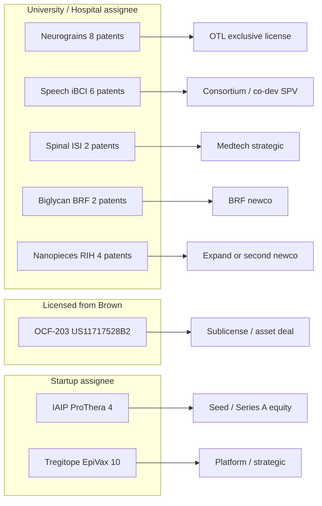
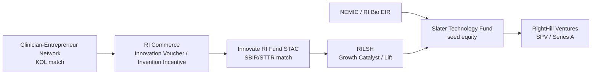

# Rhode Island Life Sciences: Citation-Backed Diligence & Investment Report

**Audience:** Early-stage investors, scientific and clinical experts, and operator diligence teams.  
**Version:** 2.5 (June 2026)  
**Primary evidence:** Amass BiomedCore (PubMed-derived) and TrialCore (ClinicalTrials.gov-derived), with PMIDs and NCT IDs cited throughout.  
**Patent evidence:** **105** discrete filings in `data/ri_patents_curated.json` (includes Morgan/ECM morsels, **Lenoss** kyphoplasty/VCF, **MindImmune** / Stevin Zorn AD, **Monaghan** deep RNA Dx, **Bolden** MuSK, **Pax** AAV-VEGF, **Christensen/Salas HiTIMED**, RIH/URI gap harvest families, **CytoVeris/OncoLux**); **19 patent-defined investable assets** + **14** grant gaps (**33** total units) in `data/ri_patent_investment_opportunities.json` v2.0 (Section 4). Many targets are **IP-centric** (Brown OTL, BRF, RIH, URI) and **grant-supported** without a discrete incorporated entity. Validate with `scripts/ri_patent_harvest.py` and MCP `project-0-ri_tech_atlas-uspto-patents` when refreshing.  
**Grant evidence:** NIH/VA RePORTER API harvest in `data/ri_grants_nih.json` plus curated non-federal awards in `data/ri_funding_matrix.json` (DARPA, NSF/COBRE, state, venture). Dollar amounts are public obligations where reported; always confirm active status in [RePORTER](https://reporter.nih.gov).

**Disclaimer:** This document is research synthesis, not investment advice, legal opinion, or clinical guidance. Retracted or preprint literature is flagged where material to diligence. Company status and trial enrollment change frequently—verify before term sheets.

---

## Table of contents

1. [Executive summary](#1-executive-summary)
2. [Methodology & reproducibility](#2-methodology--reproducibility)
3. [Rhode Island ecosystem map](#3-rhode-island-ecosystem-map)
4. [Patent-centric investment opportunities](#4-patent-centric-investment-opportunities) — incl. [4.8 Markets & comparables](#48-markets-comparables--benchmark-development-paths), [4.9 Physician-led financing & Slater match](#49-physician-led-financing-equity--kol-advisory--slater-match)
5. [Investment themes (diligence by vertical)](#5-investment-themes-diligence-by-vertical)
6. [Rhode Island experts for diligence calls](#6-rhode-island-experts-for-diligence-calls)
7. [Patent–funding correlation matrix](#7-patentfunding-correlation-matrix)
8. [Federal and non-federal funding by project](#8-federal-and-non-federal-funding-by-project)
9. [Patent annex (72 filings)](#9-patent-annex-72-filings)
10. [Clinical trial landscape (selected)](#10-clinical-trial-landscape-selected)
11. [Risks, gaps, and next diligence steps](#11-risks-gaps-and-next-diligence-steps)

---

## 1. Executive summary

Rhode Island’s life-science investable surface clusters around **Brown University / Warren Alpert Medical School**, **Brown University Health** (Rhode Island Hospital, The Miriam Hospital, Women & Infants), and a **Providence-centric startup belt** (EpiVax, Ocean Biomedical, SMURF-Therapeutics, NanoDe, Nabsys, ProThera, Volta Medical, Neurotech). Manufacturing anchors (Amgen West Greenwich, Alexion Smithfield) are mature employers rather than seed-stage venture targets.

**IP-first framing (v2.4).** Of **72** curated patent filings, **15** map to discrete **patent-defined investable assets** ([Section 4](#4-patent-centric-investment-opportunities)). **Seven** are primarily **university or hospital assignees** (Brown, Brown Research Foundation, Rhode Island Hospital) where the natural transaction is **OTL/BRF license, field-of-use sublicense, or newco formation**—not equity in an existing RI startup. **Three** high-priority academic packages—**wireless neurograins**, **speech/tablet iBCI**, and **intelligent spinal interface**—account for **~17** Brown filings and **>$25M** in cited federal non-dilutive support (DARPA + NIH/VA). Grant-only themes (SMURF2, SOMA, Levine wearables) remain investable via **researcher-enabled spinouts**; **HiTIMED** (`gap_christensen_epigenetics`) has **EP4505463A1** in curated set (Dartmouth pending)—verify US family and Brown sublicense.

### Prioritized early-stage opportunities (patent + grant correlated)

| Rank | Theme | Patents | Notable federal / other funding | Near-term path |
|------|--------|--------:|--------------------------------|----------------|
| **1** | Immunoinformatics (EpiVax) | 10 | NIH SBIR/U01 e.g. **R43AI174486**, **U01FD007760**, **R01AI132205** | Platform ARR + therapeutics |
| **2** | Chitinase antifibrosis | 1 | NHLBI **P01HL114501** (Elias); Ocean portfolio grants (verify OCF-203 license) | IND / ILD sites |
| **2d** | ECM morsels (XM Therapeutics) | 5+ | Brown BBII; **Slater $375K** seed | HF / IPF preclinical → IND |
| **3** | Nanopieces RNA (NanoDe) | 4 | STTR **R41TR002298**; RI COBRE / Life Science Hub | Ortho or CNS pilot |
| **4a** | Speech/tablet iBCI | 6+ | NIDCD **U01DC017844**; VA **I01RX004820**, **I01RX002295** | BrainGate trials |
| **4b** | Wireless neurograins | 8+ | NINDS **UH2NS095548**; DARPA **~$19M** neurograins | License / CINNR |
| **4c** | Spinal interface (ISI) | 2+ | DARPA **$6.3M** ISI; **NCT04302259** | SCI rehab device |
| **5a** | Biological kyphoplasty (Lenoss) | 7 | NEMIC / RI Commerce; **~$4M Series A** (2025 PR) | VCF commercial scale-up |
| **5b** | AD neuroinflammation (MindImmune) | 3 | **Series A $30M**; RI Life Science Hub 2025; Slater / Pfizer | MITI-101 → Phase 1 |
| **5** | SMURF2 oncology | 0* | NCI **R01CA173453**; SMURF-Tx NIH submission 2024 | Biomarker combos |
| **6** | SOMA pain DTx | 0* | COBRE **P20GM103645** pilots; Carney innovation award | FDA DTx / payer |
| **7** | IAIP neonatal sepsis | 4 | **R44AI141283**, **R44NS084575** (~$2.8M track) | LFIA + NICU |
| **8** | TME epigenetics | 0* | NCI **R01CA216265**, **R01CA253976** | HiTIMED license |
| **9** | Pediatric sepsis ML | 0* | FIC **R33TW012211**; NIDDK **R01DK116163** | LMIC → US CDSS |
| **10** | Genomics (Nabsys) | 3 | NHGRI **R43HG004433**; $1000 Genome program | Commercial OhmX |
| **11** | AF AI (Volta) | 2 | VC **~$74M** (not NIH) | SaMD expansion |
| **12** | Ophthalmology ECT | 8 | Mature Neurotech (historical NEI) | Royalty / M&A |
| **13** | Biglycan MSK | 2 | Grant linkage TBD (Fallon) | Rare disease BD |

\*Patents not yet in curated annex for this theme; expand assignee/inventor harvest.

Patent-first diligence cards: [Section 4](#4-patent-centric-investment-opportunities). Full grant tables: [Section 8](#8-federal-and-non-federal-funding-by-project).

### Cross-cutting diligence themes

- **Translation:** Brown OTL, Rhode Island Foundation, RI Life Science Hub, Ocean State Labs incubator cohort (MindImmune, OncoLux, P53 Therapeutics, Pax, **[XM Therapeutics](https://www.xmtherapeutics.com)**). **IP-first targets** are catalogued in [Section 4](#4-patent-centric-investment-opportunities)—seven academic/hospital assignee packages do not require an existing startup.
- **Clinical access:** Lifespan Cancer Institute (WIN consortium), Center for Advanced Lung Care / ILD program (fibrosis), Women & Infants perinatal trials, BrainGate at Rhode Island Hospital and MA sites.
- **Reimbursement:** Volta (FDA-cleared AF mapping); SOMA (consumer/research app—payer path immature); EpiVax (B2B/services + therapeutics spinout).
- **Physician-led + Slater match:** For formation-stage assets, see [§4.9](#49-physician-led-financing-equity--kol-advisory--slater-match) — **physician-led** = clinician **equity** plus formal **KOL advisory** (not trial-site-only). Machine-readable gates: `data/ri_physician_led_financing.json`.

---

## 2. Methodology & reproducibility

### Literature and trials (Amass)

- BiomedCore searches by **author**, **institution**, and **topic** with `minJournalQualityJufo` where noted.
- TrialCore searches by **facility**, **sponsor**, and **condition**; verify site lists on ClinicalTrials.gov before assuming RI enrollment.

### Patents

- Curated set: `data/ri_patents_curated.json` (**72** filings, June 2026).
- **IP-first opportunity registry:** `data/ri_patent_investment_opportunities.json` (**15** patent-defined assets + 3 grant gaps).
- **Physician-led / Slater match:** `data/ri_physician_led_financing.json` — equity + KOL advisory definition, 18-month gates, per-asset milestones.
- Rate-limited live harvest: `docs/RATE_LIMITED_RESEARCH.md`, `scripts/ri_patent_harvest.py`.
- **Do not** bulk-fetch claims via MCP; use `ppubs_get_patent_by_number` on ≤10 priority assets per diligence cycle.

### Web / company resolution

- Entity names, HQ, and public listings cross-checked via web search (BioPharmGuy RI directory, press releases, Brown Health provider pages). **Mock or inferred financials are not used.**

### Markets, comparables & financing benchmarks

- **Market sizing** and **comparable company financing / development paths** in [Section 4.8](#48-markets-comparables--benchmark-development-paths) and under each theme in Section 5 (**Market & comparables**).
- Figures are from **public press releases, SEC filings, third-party market reports**, and **Amass BiomedCore/TrialCore** (June 2026). Scopes and methodologies differ across vendors—treat as **order-of-magnitude framing**, not RI valuation inputs. No private cap tables or revenue for RI companies unless cited in public sources.

### Amass MCP enrichment (literature & trials)

- **BiomedCore:** Author/institution searches (e.g., Jeffrey Morgan + Brown; **Stevin Zorn** + dendritic cell / Alzheimer’s; VCF / kyphoplasty comparators) for PMIDs cited in §4 and §5.
- **TrialCore:** Landscape scans by indication; no XM Therapeutics–sponsored interventional trial identified at time of enrichment.
- **USPTO MCP:** Intended for Morgan/Brown assignee harvest; if `uspto-patents` server offline, use `scripts/ri_patent_harvest.py` after cooldown per `docs/RATE_LIMITED_RESEARCH.md`.

### Grants and non-dilutive capital

- **NIH/VA:** `python3 scripts/fetch_nih_grants.py` → `data/ri_grants_nih.json` (RePORTER API v2).
- **Curated matrix:** `data/ri_funding_matrix.json` maps **19 investment themes** to patents + NIH/VA/DARPA/NSF(COBRE)/state/VC rows with URLs.
- **Refresh:** Re-run fetch script quarterly; add NSF Award Search and SAM.gov for SBIR Phase III manually.

### Citation format

- Publications: `PMID` + DOI link.
- Trials: `NCT` ID.
- Patents: US/WO number; independent claims require MCP or USPTO PDF review.
- Grants: project number (e.g. `R44AI141283`) + [RePORTER](https://reporter.nih.gov) or primary press/SBIR URL.

---

## 3. Rhode Island ecosystem map

### Companies (Providence and statewide)

| Company | Location | Focus | Diligence note |
|---------|----------|-------|----------------|
| [EpiVax](https://epivax.com) | Providence | iVAX, Tregitope, ISPRI | Mature platform; PMID [32318055](https://doi.org/10.3389/fimmu.2020.00442) |
| EpiVax Therapeutics | Providence | Oncology immunotherapy spinout | Pipeline stage—verify IND status |
| [Ocean Biomedical](https://oceanbiomedical.com) (OCEA) | Providence | Elias fibrosis assets (Chit1/OCF-203) | Public; US11717528B2 |
| Elkurt Therapeutics | RI-linked | 18 glycosyl hydrolase family (Elias co-founder) | Private; parallel to Ocean |
| [SMURF-Therapeutics](https://smurftherapeutics.com) | Providence | Smurf2 modulators (El-Deiry) | Preclinical; founded 2021 |
| [NanoDe Therapeutics](https://nanodetherapeutics.com) | Providence | Nanopieces RNA delivery | RIH/Brown license; RI Life Science Hub award |
| [Nabsys 2.0](https://www.nabsys.com) | Providence | Electronic genome mapping | Hitachi majority interest |
| [ProThera Biologics](https://www.protherabiologics.com) | Providence area | IAIP sepsis/NEC | RIH/Women & Infants collaborations |
| [Volta Medical](https://www.volta-medical.us) | Providence | AI AF ablation (VX1) | FDA-cleared; US10750967B2 |
| [Neurotech Pharmaceuticals](https://www.neurotechpharmaceuticals.com) | Cumberland | Encapsulated cell therapy (CNTF) | Late-stage ophthalmology |
| [BrainGate](https://www.braingate.org) | Brown + RI Hospital | iBCI clinical trials | NCT00912041 family |
| [**Lenoss Medical**](https://lenoss.com) | Providence | Biological kyphoplasty / VCF (OsteoPearl) | **23** granted patents (press); Dom Messerli; [§5.14](#514-biological-kyphoplasty--vcf-lenoss-medical--osteopearl) |
| [**MindImmune**](https://mindimmune.com) | Kingston (URI Ryan Institute) | AD neuroinflammation (MITI-101 mAb) | **Series A $30M**; Zorn CSO; Ocean State Labs; [§5.15](#515-alzheimers-neuroinflammation-mindimmune--stevin-zorn) |
| [**Bolden Therapeutics**](https://www.boldentherapeutics.com) | Providence | MuSK-pathway ASO neurogenesis | Brown OTL **US12458657B2**; Slater pre-seed; NIA STTR — atlas `ip_bolden_musk_neurogenesis` |
| [**ni2o**](https://ni2o.com) | Providence | KIWI wireless micro-implant BCI | Oxford/MIT-origin; BrainGate FTO diligence — atlas `gap_ni2o_kiwi_bci` |
| [**OncoLux**](https://oncoluxinc.com) | Providence | LUMIS optical theranostics | RILSH attraction; Ocean State Labs; Mayo 2026 — atlas `ip_oncolux_lumis` |
| [**Pax Therapeutics**](https://www.paxtherapeutics.com) | Providence / RIH | AAV2–VEGF tendon (PAX-001) | **WO2019146830A1**; RILSH LIFT; Ocean State Labs — atlas `ip_pax_aav_vegf_tendon` |
| [**XM Therapeutics**](https://www.xmtherapeutics.com) | Providence | Injectable human ECM morsels (HF, IPF) | Brown OTL spinout 2022; Slater seed; Morgan IP — [§5.13](#513-ecm-morsels--cardiac--pulmonary-fibrosis-xm-therapeutics--jeffrey-r-morgan) |
| Amgen / Alexion | West Greenwich / Smithfield | Biologics manufacturing | Anchor employers |

### Institutions

- **Brown University** — Alpert Medical School, Carney Institute (computational psychiatry), School of Engineering (Borton, Nurmikko).
- **Brown University Health** — Rhode Island Hospital, Miriam, Women & Infants; [Center for Advanced Lung Care](https://www.brownhealth.org/centers-services/center-advanced-lung-care).
- **Lifespan / Cancer Institute** — WIN (Wafik El-Deiry network), oncology trials.
- **VA Medical Center, Providence** — BrainGate site.

---

## 4. Patent-centric investment opportunities

Most RI life-science value is **not** captured by counting incorporated companies alone. **Brown University** holds **23** of **57** curated filings; **Rhode Island Hospital** and **Brown Research Foundation (BRF)** hold hospital- and muscle-regeneration estates. Federal and DARPA awards often flow to **PIs and consortia** (BrainGate, Nurmikko neurograins, Borton spinal interface) while commercialization rights sit in **OTL invention disclosures and patent families**.

**Machine-readable registry:** `data/ri_patent_investment_opportunities.json` — **15** scored assets plus **3** grant-supported gaps pending patent harvest.

### 4.1 How patents define the investable unit

| Dimension | What to diligence |
|-----------|-------------------|
| **Assignee** | University vs hospital vs BRF vs startup vs public licensee |
| **Cluster depth** | Continuation families (e.g., 10× Tregitope, 8× wireless neurotech) |
| **Grant stack** | Active SBIR/STTR/R01/U01/DARPA/VA tied to same inventors |
| **Vehicle** | Exclusive license, spinout, consortium sublicense, SPV asset purchase, royalty |
| **Encumbrance** | Existing exclusive license (Ocean/OCF-203), trial consortium terms, Hitachi/Nabsys |

**Promise tier (A / B / C)** in the tables below combines patent cluster depth, federal funding signal, and clarity of a transaction path—not a valuation or recommendation.

### 4.2 Priority patent-defined assets (ranked)

| Rank | Asset ID | Title | Tier | Patents (n) | Assignee | Vehicle | Existing entity | Federal anchor |
|------|----------|-------|------|------------:|----------|---------|-----------------|----------------|
| 1 | `ip_wireless_neurograins` | Wireless neurograins & distributed cortical implants | **A** | 8 | Brown | OTL license / spinout | — | DARPA ~$19M; UH2NS095548 |
| 2 | `ip_speech_tablet_ibci` | Speech decoding & multi-device tablet iBCI | **A** | 6 | Brown | Consortium / device co-dev | BrainGate | U01DC017844; VA I01 |
| 3 | `ip_nanopieces_rna` | Nanopieces non-viral RNA delivery | **A** | 4 | RIH | License / expand NanoDe | NanoDe | R41TR002298; COBRE |
| 4 | `ip_chitinase_ocf203` | Chitinase-1 antifibrosis (OCF-203) | **A** | 1 | Licensed (Ocean) | Sublicense / newco / asset | Ocean; Elkurt | P01HL114501 |
| 4a | `ip_ecm_morsels_xm` | Decellularized ECM morsels (injectable matrix) | **A** | 5 | Brown → XM Therapeutics | Seed / Series A equity | XM Therapeutics | BBII; Slater $375K |
| 5 | `ip_iaip_neonatal` | IAIP biologics & sepsis/NEC LFIA | **A** | 4 | ProThera | Equity | ProThera | R44AI141283; R44NS084575 |
| 5a | `ip_osteopearl_vcf_lenoss` | Biological kyphoplasty — OsteoPearl & Elevoss | **B** | 7 | Lenoss Medical | Growth / strategic | Lenoss | NEMIC; Series A ~$4M |
| 5b | `ip_dendritic_ad_mindimmune` | Dendritic-cell blockade / Alzheimer's (MITI-101) | **A** | 3 | MindImmune | Series A / co-invest | MindImmune | Series A $30M; RI Hub 2025 |
| 6 | `ip_spinal_isi_dbs` | Intelligent spinal interface & closed-loop DBS | **A** | 2 | Brown | Medtech license / SPV | — | DARPA $6.3M; NCT04302259 |
| 7 | `ip_tregitope_immunomod` | Tregitope regulatory epitope therapeutics | **B** | 10 | EpiVax | Platform / spinout equity | EpiVax | SBIR/U01 stack |
| 8 | `ip_biglycan_msk` | Biglycan MSK / neuromuscular regeneration | **B** | 2 | BRF | OTL newco | — | Grant linkage TBD |
| 9 | `ip_neural_decoding_legacy` | Core BMI decoding & cortical interface | **B** | 5 | Brown | Field-of-use / royalty | BrainGate | Multi-IC |
| 10 | `ip_af_mapping_ai` | AI AF ablation mapping (VX1) | **B** | 2 | Volta | Growth / strategic | Volta | VC ~$74M |
| 11 | `ip_genomics_hans` | HANS / electronic genome mapping | **C** | 3 | Nabsys | Strategic M&A | Nabsys 2.0 | R43HG004433 |
| 12 | `ip_ect_ophthalmology` | Encapsulated cell therapy (CNTF) | **C** | 8 | Neurotech | Royalty / M&A | Neurotech | Historical NEI |

**Tier A (7 assets):** Best fit for **formation capital, OTL-exclusive license, or asset SPV**—strong patent anchor plus active grants and/or recruiting trials. **Four** are **academic/hospital-primary** (rows 1–2, 4, 6); **one** is hospital IP with startup optionality (row 3); **two** are startup-held with Brown-origin IP (**XM Therapeutics** row 4a; ProThera row 5).

**Tier B (4 assets):** Platform, BRF out-license, legacy decoding stack, or growth SaMD—still patent-material but different check size and risk.

**Tier C (2 assets):** Mature assignees; patents support **secondary liquidity**, not classic seed.

### 4.3 Academic & hospital packages (no required startup)

These opportunities are **researcher-enabled** and **patent-anchored**; investors typically structure through **Brown OTL**, **RIH licensing**, or a **newco** rather than assuming an existing RI C-corp.

#### Wireless neurograins (`ip_wireless_neurograins`)

- **Patents:** US10433754B2 (implantable wireless neural device); US11464964B2 (distributed wireless nodes); WO2016187254A1 / WO2020018571A1 (chiplet intranet); US20200367749A1 (microscale sensor network); US20200229704A1 (optoelectronic read/write).
- **Inventors:** Nurmikko, Borton, Rosenstein, Mercier, Asbeck.
- **Non-dilutive:** DARPA neurograins up to **~$19M**; NIH UH2NS095548 (~$2.0M).
- **Thesis:** Replace tethered arrays with scalable wireless nodes—distinct from speech/tablet decoding IP (Section 5.6).
- **Comparable diligence:** Paradromics, Neuralink interface programs (FTO vs Brown family); Blackrock does not own wireless grain stack.
- **Transaction:** Exclusive field-of-use license to medtech or BCI hardware newco; verify OTL encumbrances vs BrainGate consortium.

**Market & comparables (wireless neurograins).** Global **BCI ~$2.1B by 2030** (see [§4.8](#48-markets-comparables--benchmark-development-paths)). **Paradromics (~$121M raised)** and **Blackrock ($200M Tether, 2024)** benchmark **cortical implant commercialization**; wireless grains differentiate on **distributed nodes vs tethered Utah array**. **RI path:** DARPA + UH2 → **OTL license / $30–80M hardware spinout**—not speech-decoding SPV.

#### Speech & tablet iBCI (`ip_speech_tablet_ibci`)

- **Patents:** US12042303 (speech communication); US11972050 (multi-device BCI); US12561001 (high-accuracy element selection); US10448877B2 (neurological event prediction); US18946156 (sustained grasp commands).
- **Inventors:** Hochberg, Simeral, Hosman, Goldberg, Vargas-Irwin.
- **Clinical:** NCT05724173, NCT06094205, NCT06511934 (recruiting).
- **Non-dilutive:** U01DC017844; VA I01RX004820, I01RX002295.
- **Thesis:** Human speech/tablet data and decoding algorithms are licensable **separately** from implant vendor—consortium or SaaS/device wrapper SPV.
- **RI experts:** Hochberg, Simeral; VA CfNN (Providence).

#### Nanopieces RNA (`ip_nanopieces_rna`)

- **Patents:** US11701094B2, US11608340B2, US12357635B2, US20230183253A1 — all **Rhode Island Hospital** assignee, Chen inventor.
- **Non-dilutive:** STTR R41TR002298; orthopedics COBRE P20GM104416; RI Life Science Hub Growth Catalyst.
- **Thesis:** Hospital-owned delivery platform; [NanoDe](https://nanodetherapeutics.com) is one licensee path—additional fields (CNS, fibrosis payload) may support **second newco** or expanded license.
- **Caution:** RePORTER PI name collisions for “Chen Qian”—anchor diligence on **R41TR002298** and RIH OTL file.

#### Chitinase / OCF-203 (`ip_chitinase_ocf203`)

- **Patent:** US11717528B2 — Chitinase 1 inhibition for fibrosis (Elias, Brown origin).
- **Non-dilutive:** NHLBI P01HL114501 (active Elias engine).
- **Thesis:** Single flagship filing in curated set; economics depend on **license chain** (Ocean Biomedical, Elkurt, or re-licensed newco). **Mandatory:** confirm OCF-203 sublicense status post-2025 press.
- **Clinical access:** Brown Health Center for Advanced Lung Care / ILD program.

#### Intelligent spinal interface (`ip_spinal_isi_dbs`)

- **Patents:** WO2019027517A1 (effortful mental task DBS facilitation); US20170042713A1 (mobile medical monitoring — Borton/Nurmikko/Simeral).
- **Non-dilutive:** DARPA ISI **$6.3M**; NCT04302259 IDE at RIH.
- **Thesis:** SCI + bladder rehabilitation device path—**medtech strategic** or hospital-aligned SPV, not cortical BCI competitor.

**Market & comparables (spinal ISI).** SCI neuromodulation: [**ONWARD Medical**](https://onwd.com) **€50M raise (Oct 2024)**; **ARC-EX** cleared US/EU; **ARC-IM** pivotal; **F-1 filed** for potential Nasdaq IPO ([ONWARD FY2025 release](https://live.euronext.com/en/products/equities/company-news/2026-03-31-onward-medical-reports-full-year-2025-financial-and)). **RI path:** DARPA **$6.3M** + **NCT04302259 IDE** → **license to ONWARD-class strategic** or **$20–40M medtech SPV**—shorter path than cortical BCI.

#### Biglycan regeneration (`ip_biglycan_msk`)

- **Patents:** US8658596B2, US20110183910A1 — **Brown University Research Foundation**, Fallon inventor.
- **Thesis:** Rare neuromuscular / MSK package with **no RI startup** in ecosystem map—archetypal **BRF → OTL → newco** opportunity.
- **Gap:** Active NIH awards on Fallon program not harvested—add RePORTER PI search.

**Market & comparables (biglycan MSK).** Rare neuromuscular gene therapy **multi-billion TAM**; commercial analogs include **Sarepta** (approved MSK gene therapies) and **Solid Biosciences** (DMD—**restructuring lessons** on systemic AAV). **RI path:** **BRF OTL → $20–50M Series A newco** after **IND-enabling** package; no RI startup in map—classic **university out-license**.

### 4.4 Company-held but IP-material packages

| Asset | Why patents still define diligence | Key numbers |
|-------|-----------------------------------|-------------|
| **ECM morsels / XM Therapeutics** | Brown OTL stack on microtissue fabrication + decellularized human ECM particles; Slater-backed seed company | US20230348859A1, WO2022140530A1, US8361781B2, US11286451B2, US12435312B2 |
| **IAIP / ProThera** | Four-filing estate covers composition, treatment method, reissue | US7932365B2, US9572872B2, USRE47972E1 |
| **Tregitope / EpiVax** | Largest non-neuro patent cluster; platform + therapeutic splits | US7884184B2, US10213496B2, US11844826B2 |
| **Volta VX1** | FDA-cleared SaMD with AI mapping claims | US10750967B2 |
| **Nabsys HANS** | Brown-origin nanopore hybridization IP | US20070190542A1, WO2007041621A2 |
| **Neurotech ECT** | Eight-filing CNTF delivery moat in RI manufacturing | US12485087B2, US9149427B2 |
| **OsteoPearl / Lenoss** | Kyphoplasty instrumentation + biological VCF implant; J&J-licensed flexible-chain lineage | US10993756B2, US12029463B2, USD1106456S1 |
| **MindImmune / Zorn** | Dendritic-cell recruitment AD thesis; MITI-101 mAb program | US20210181185A1 (abandoned app—verify continuations) |

#### XM Therapeutics & Jeffrey R. Morgan ECM estate (`ip_ecm_morsels_xm`)

**Enrichment source:** Amass BiomedCore (author **Jeffrey Morgan**, Brown; query ECM morsels / microtissue, June 2026). USPTO MCP `ppubs_search_patents` was unavailable in this build—patent numbers verified via Brown OTL / publication cross-walk; run `ppubs_get_patent_by_number` on **US20230348859A1** when PPUBS cooldown permits.

**Company.** [XM Therapeutics](https://www.xmtherapeutics.com) (Providence, founded **2022**); President/CEO Frank Ahmann; co-founder **Jeffrey R. Morgan**, PhD (Brown Pathology & Engineering). [Slater Technology Fund](https://slaterfund.com/slater-invests-in-xm-therapeutics/) reported **$375,000** seed investment (total Slater XM funding cited at **$750K** in press). Brown BBII / Technology Innovations supported formation ([Brown Innovation Showcase 2023](https://www.brown.edu/news/2023-10-06/showcase)).

**Thesis.** Lab-grown, **decellularized human ECM morsels** (~200 μm) from 3D microtissues (agarose micromold / self-assembly platform) for **intramyocardial or tissue injection**—intended to interrupt pathological ECM remodeling (inflammation, fibrosis, hypoxia) in **heart failure** and **pulmonary fibrosis**, distinct from small-molecule chitinase inhibition (§5.2).

**Key patents (Brown assignee; XM licensee).**

| Patent | Title | Inventors | Note |
|--------|-------|-----------|------|
| **US8361781B2** | Self-assembly of microtissues (3D Petri dish) | Morgan et al. | Foundational fabrication |
| **US11286451B2** | Funnel-guided microtissue stacking | Morgan; Manning; Ip | Manufacturing |
| **US12435312B2** | Collagen synthesis / alignment / mechanics assay | Morgan; Wilks | Fibrosis model QC (2023 filing) |
| **US20230348859A1** | Decellularized ECM morsels | Morgan; Ip | Therapeutic composition (continues PCT) |
| **WO2022140530A1** | ECM morsels PCT | Morgan; Ip | Priority US 63/129,966 (Dec 2020) |

**Key evidence (Amass BiomedCore).**

| PMID | Finding | Citations |
|------|---------|-----------|
| [39705507](https://doi.org/10.1152/ajpheart.00581.2024) | Lab-grown human 3D ECM particles (~200 μm) reduce infarct size, improve FS after LAD ligation in mice; Sellke & Morgan co-authors | 2 |
| [40013741](https://doi.org/10.1080/03008207.2025.2469575) | TGF-β1 + IL-13 sustains collagen accumulation and ring tissue stiffness in Morgan 3D fibrosis model | 3 |
| [30267883](https://doi.org/10.1016/j.actbio.2018.09.030) | Decellularized aligned collagen matrices from self-assembled fibroblasts (Wilks, Morgan) | 31 |
| [26610075](https://doi.org/10.1016/j.biomaterials.2015.10.080) | Self-assembled microtissues control ECM synthesis and alignment | 43 |

**Clinical / regulatory.** No XM-sponsored interventional NCT located in Amass TrialCore (June 2026); company states preclinical PoP and production platform build-out. Cardiothoracic clinical anchor: **Frank W. Sellke**, MD (Brown / RIH). Pulmonary fibrosis diligence should cross-walk **ILD program** (Putman, Ventetuolo) and distinguish mechanism vs **chitinase** assets.

**Diligence vs chitinase (Ocean/Elias).** Both target fibrosis/heart failure TAM; **XM** is **biologic/matrix remodeling** injectable; **OCF-203** is **small-molecule enzymatic** inhibition—complementary FTO and indication sequencing, not redundant IP.

**Recommended MCP follow-up:** `get_amass_biomedcore_record` on PMID 39705507; `ppubs_get_patent_by_number` US20230348859A1 (independent claims); RePORTER PI **Morgan Jeffrey** for active NIH awards.

#### Lenoss Medical — biological kyphoplasty (`ip_osteopearl_vcf_lenoss`)

**Enrichment source:** Amass BiomedCore (VCF / kyphoplasty literature); Google Patents assignee **Lenoss Medical** (June 2026).

**Company.** [Lenoss Medical](https://lenoss.com) (Providence HQ, 150 Chestnut St). Founder/CEO **Dom Messerli** (ex–DePuy Synthes Spine R&D). Product: **OsteoPearl** VBA — linked **100% cortical allograft** pearls (MTF Biologics tissue) as an alternative to **PMMA cement** kyphoplasty/vertebroplasty. Instrumentation: **Elevoss** cavity creator uses **transverse displacement** of vertebral cancellous bone (resilient strips) rather than a balloon ([US10993756B2](https://patents.google.com/patent/US10993756B2) family).

**Curated kyphoplasty / implant patents (anchor set; company cites **23** granted worldwide).**

| Patent | Title | Note |
|--------|-------|------|
| **US10993756B2** | Transversely displacing structures in the body | Kyphoplasty cavity / Elevoss (granted 2021) |
| **US10219851B1** | Same (earlier continuation) | Granted 2019 |
| **US12029463B2** | Same (continuation) | Active to 2038 |
| **US20250099150A1** | Same (pending, filed 2024) | — |
| **USD1106456S1**, **USD1106457S1** | Flexible implant (design) | OsteoPearl linked pearls (Dec 2025) |
| **US8673010B2** | Flexible chain implants | **DePuy assignee**; exclusive **J&J license** to Lenoss per [Slater profile](https://slaterfund.com/lenoss-osteopearl/) |

**Financing / path (public).** [Providence Business News](https://pbn.com/lenoss-medical-raises-4m-series-a-funding/) and trade press (**~$4M Series A**, 2025); LinkedIn aggregate **~$12.6M** total funding cited; **150th** implant milestone (2025). NEMIC Activate + RI Commerce Innovation Voucher ([NEMIC spotlight](https://nemic.org/news/startup-spotlight-lenoss-medical-vertebral-compression-treatment)).

**Evidence.** Market context: balloon kyphoplasty outcomes [PMID 29547939](https://doi.org/10.1093/neuros/nyy017) (EVOLVE trial); Lenoss cites ovine histology on product site. **Diligence:** confirm **510(k)/cleared** status, cement-leakage comparative claims, and full **23-patent** list vs curated anchors.

#### MindImmune Therapeutics — Alzheimer's neuroinflammation (`ip_dendritic_ad_mindimmune`)

**Enrichment source:** Amass BiomedCore (**Stevin Zorn**, dendritic cells / AD); Google Patents assignee **MindImmune** (June 2026).

**Company.** [MindImmune](https://mindimmune.com) (South Kingstown / URI **George & Anne Ryan Institute**). Founded **2016** by Pfizer/Lundbeck veterans **Stevin Zorn**, **Frank Menniti**, **Robert Nelson**, **Brian Campbell**. Lead asset **MITI-101**: anti-**CD11c** mAb to block **peripheral dendritic-cell recruitment** into AD brain (“nip Alzheimer’s in the blood”). **Nov 2025:** **$30M** Series A (incl. **$10.2M** extension); **Isaac Stoner** CEO; **Zorn** → CSO ([Business Wire](https://www.businesswire.com/news/home/20251124077423/en/MindImmune-Extends-Series-A-to-30M-to-Advance-Inflammation-Focused-Alzheimers-Therapy-into-the-Clinic-and-Appoints-Isaac-Stoner-as-CEO)). Investors include **Dolby Family**, **Pfizer Ventures**, **Slater**, **RightHill**, **Gates Frontier**. **June 2025:** [RI Life Science Hub](https://www.mindimmune.com/news/mindimmune-awarded-grant-to-accelerate-ind-enabling-studies-through-rhode-island-life-science-hub) grant for IND-enabling tox/CMC.

**Zorn / Nelson patent thesis (curated).**

| Patent | Title | Inventors | Status note |
|--------|-------|-----------|-------------|
| **US20210181185A1** | Dendritic cell recruitment from blood to brain in neurodegenerative disease | Zorn; Nelson; Menniti; Campbell | USPTO **Abandoned** (verify CIP/continuation filing for MITI-101 FTO) |
| **US10124010B2** | Cyclic amines | MindImmune | Legacy small-molecule; not MITI-101 |
| **US10238654B2** | Benzamides for epilepsy (Lundbeck co-assignee) | MindImmune / Lundbeck | Historical chemistry estate |

**Key evidence (Amass).** [PMID 38705533](https://doi.org/10.1016/j.bcp.2024.116258) — Nelson, Menniti, **Zorn**: recruited **myeloid dendritic cells** surround amyloid plaques; challenges microglia-only dogma. Company science page mirrors thesis. **TrialCore:** no **MindImmune-sponsored** interventional NCT at enrichment (MITI-101 pre-IND).

**Diligence vs anti-amyloid.** Orthogonal to **Aβ mAb** (lecanemab/donanemab); immune **upstream** of plaque biology per company narrative—confirm biomarker strategy (CD11c+ recruitment assays) and **abandoned** method patent prosecution path.

### 4.5 Grant-supported gaps (not yet in patent annex)

| Gap ID | Theme | Grant signal | Patent action |
|--------|-------|--------------|---------------|
| `gap_smurf2_oncology` | SMURF2–HIF1α | R01CA173453; SMURF-Tx 2024 submission | Harvest El-Deiry + SMURF-Therapeutics assignee |
| `gap_soma_dtx` | SOMA pain / interoception | COBRE P20GM103645 pilots | USPTO Petzschner / Gunsilius; copyrights |
| `gap_christensen_epigenetics` | HiTIMED / immune epigenetics | R01CA253976, R01CA216265 | **EP4505463A1** (Dartmouth pending); Brown sublicense TBD |

### 4.6 Investor mapping: patent cluster → transaction type

### 4.7 Recommended MCP / claims diligence (Tier A)

Pull independent claims (≤10 per cycle) for: **US10433754B2**, **US12042303**, **US11701094B2**, **US11717528B2**, **WO2019027517A1**, **US7932365B2**, **US20230348859A1** (XM ECM morsels), **US10993756B2** (Lenoss kyphoplasty cavity), **US20210181185A1** (MindImmune dendritic recruitment—verify active family). Cross-walk to `data/ri_funding_matrix.json` theme IDs in [Section 7](#7-patentfunding-correlation-matrix).

### 4.8 Markets, comparables & benchmark development paths

Public-market and venture benchmarks help RI investors (e.g., Slater Fund, RightHill Ventures) and expert reviewers place **formation-stage OTL packages** vs **growth-stage RI companies**. Comparable financing and paths below are **illustrative**—verify current round status in data rooms.

#### Summary matrix (RI entity → market → benchmark path)

| RI focus | Asset / company | Market framing (public sources) | IP / tech overlap | Comparable(s) | Comparable financing & path | RI-relevant development path |
|----------|-----------------|--------------------------------|-------------------|---------------|----------------------------|------------------------------|
| Immunoinformatics | EpiVax (`ip_tregitope_immunomod`) | In silico immunogenicity + vaccine design services; adjacent to ~$50B+ global vaccine/biologics de-risk spend (fragmented) | Tregitope / iVAX epitope removal | **AbCellera** (ABCL); **Absci** (ABSI) | ABCL: ~$555M IPO (2020); pivoted 2023–25 to internal pipeline; ~$700M liquidity (2025 10-K). ABSI: $86M follow-on (2024); AstraZeneca deal up to $247M; AMD $20M (2025) | **Platform + services → therapeutic spinout:** SBIR/U01 stack → Series A/B therapeutics or strategic platform license (EpiVax model) |
| IPF / chitinase | Ocean / Elkurt (`ip_chitinase_ocf203`) | Global **IPF treatment ~$3.7–4.7B (2024–26)** → **~$5.2–6.4B by 2030–31** (6–8% CAGR); broader fibrosis therapeutics **~$5.8B (2024)** | Chitinase-1 / CHI3L1 inhibition (non–TGF-β-only) | **Pliant** (PLRX); **Boehringer** (Ofev/nerandomilast) | Pliant: public; **bexotegrast discontinued 2025** after BEACON-IPF safety signal—integrin path cautionary. Incumbents: decades of Phase 3 → approval | **Academic P01 → license → IND:** Brown/Elias → Ocean (public OCEA) or Elkurt newco; confirm OCF-203 chain before asset deal |
| ECM morsels / HF–IPF | XM Therapeutics (`ip_ecm_morsels_xm`) | Same IPF/HF TAM; **cardiac failure + fibrosis remodeling** injectable biologic niche | Decellularized human ECM particles; microtissue platform (Morgan) | **Ventrix** (cardiac ECM gel, historical); **Heartseed** (iPSC CM transplant); matrix therapy sector | Ventrix: Phase 2 HF trials (animal-derived ECM caution). Heartseed: **~$41M** Series B (2024, Japan) cell therapy | **Brown BBII → Slater $375K seed → Series A:** preclinical MI data ([PMID 39705507](https://doi.org/10.1152/ajpheart.00581.2024)) → large-animal → IND; OTL license to XM |
| SMURF2 / HIF | SMURF-Tx (`gap_smurf2_oncology`) | HIF pathway validated commercially (**Welireg** ~**$199M/qtr**, +43% YoY Q1 2026); crowded oncology | SMURF2–HIF1α degradation axis | **Merck Welireg**; **Inotrem** (sepsis biologic, financing proxy) | Welireg: big-pharma Phase 3 → multi-indication expansion. Inotrem: **~€58M Series B** (2020); Phase 3 **ACCURATE** agreed with FDA/EMA; Roche Dx companion | **Grant-first RI startup:** R01CA173453 → SBIR/NIH 2024 submission → seed/Series A after biomarker PoC (no public VC round disclosed) |
| Pain / interoception DTx | SOMA (`gap_soma_dtx`) | **Digital chronic pain therapeutics ~$3–4B (2024)** → **~$15–24B by 2033–34** (17–23% CAGR) | Computational interoception; consumer/research app | **Kaia Health**; **AppliedVR**; **Pear** (caution) | Kaia: **$125M** total, **$75M Series C** (2021); later acquired. AppliedVR: **~$65M** VC. Pear: FDA-cleared DTx → **Chapter 11 (2023)** payer/reimbursement lesson | **COBRE pilots → spinout → FDA SaMD:** Carney award → pivotal + payer evidence before growth equity |
| Non-viral RNA | NanoDe (`ip_nanopieces_rna`) | Non-viral genetic medicines / extrahepatic delivery; LNP market large but **orthogonal nanocarrier** niche | Janus nanotube / Nanopieces ECM penetration | **Aera Therapeutics**; **Generation Bio** (caution) | Aera: **$193M** Series A+B (2023), Feng Zhang PNP/tLNP. GBIO: **~$236M** private + IPO; **restructured 2023**; acquired by XOMA **2025**—non-viral scale-up risk | **STTR + hospital IP → Series A:** R41TR002298 → RIH OTL license → ortho/CNS IND-enabling (NanoDe) |
| Speech / tablet iBCI | BrainGate / Brown (`ip_speech_tablet_ibci`) | Global **BCI ~$1.1–1.7B (2024–25)** → **~$2.1–3.1B by 2030** (~10–14% CAGR); speech/recording premium | Cortical speech decoding, tablet control | **Paradromics**; **Synchron**; **Blackrock** | Paradromics: **~$121M** total; FDA Breakthrough; IDE/clinical 2025. Synchron: **~$345M** total; **$200M Series D** (2025); endovascular Stentrode. Blackrock: **$200M** Tether (2024) commercialization | **Multi-IC grants → consortium license / SPV:** U01/VA trials → decode IP licensed separate from implant vendor |
| Wireless neurograins | Brown OTL (`ip_wireless_neurograins`) | Same BCI TAM; **hardware + distributed sensing** subsegment | Wireless microscale nodes vs tethered Utah array | **Paradromics**; **Neuralink**; **Blackrock Utah Array** | Paradromics: high-channel cortical implant IDE path. Neuralink: private mega-rounds; different risk. Blackrock: research + clinical Utah Array, **FDA-cleared in humans** | **DARPA de-risk → OTL exclusive license / spinout:** ~$19M DARPA + UH2 → medtech partner or newco (not cortical speech stack) |
| Spinal ISI | Brown (`ip_spinal_isi_dbs`) | SCI neuromodulation; overlapping **neurostimulation ~$billions** (medtech) | Closed-loop spinal / DBS facilitation | **ONWARD Medical** (ONWD); DARPA SCI programs | ONWARD: Euronext IPO 2021; **€50M** raise Oct 2024; **ARC-EX** US/EU cleared; **F-1 filed** for potential Nasdaq IPO 12–18 mo | **DARPA IDE → strategic device partner:** $6.3M ISI + NCT04302259 → license to ONWARD-class strategic or SPV |
| IAIP sepsis | ProThera (`ip_iaip_neonatal`) | Neonatal sepsis / diagnostics; **host-response Dx ~$200M+** at MeMed scale | IAIP biologic + LFIA | **Inotrem**; **MeMed** | Inotrem: **€39–58M** Series B; Phase 3 septic shock. MeMed: **>$200M** total; **$93M Series E** (2022); **FDA 510(k)** BV test | **SBIR Fast Track → Series A:** ~$12M cited NIH on IAIP → LFIA + biologic IND parallel paths |
| TME epigenetics | Christensen OTL (`gap_christensen_epigenetics`) | Immuno-oncology biomarker / diagnostics; methylation deconvolution niche | HiTIMED / blood TME deconvolution | **CiberSortX** (licensing); **Epicypher** (epigenetic tools) | CiberSortX: software license revenue model. Epicypher: venture-backed epigenetics reagents + programs | **R01 → OTL software license → pharma stratification:** no classic VC; upfront + milestones with pharma |
| Pediatric sepsis ML | Levine (`pediatric_digital_sepsis`) | Hospital early-warning / predictive analytics embedded in EHR | Wearable + ML sepsis lead time | **Epic sepsis models**; **PeraHealth**; **Philips** | Epic: EHR-embedded; enterprise sales. PeraHealth: Rothman Index commercialization. Philips: hardware + software ICU | **R33 global → US SaMD:** FIC R33 → FDA classification → health-system pilot (not consumer) |
| AF SaMD | Volta (`ip_af_mapping_ai`) | AF ablation **~$billions** procedure volume; AI mapping adjunct | Dispersed EGM AI mapping | **Acutus** (historical); mapping incumbents | Volta: **>€90M** total; **€36M Series B** (2023); **FDA-cleared VX1**; TAILORED-AF RCT | **Seed → CE/FDA SaMD → Series B commercial:** Providence growth equity, not university spinout |
| Structural genomics | Nabsys (`ip_genomics_hans`) | SV/cytogenetics tools; **OGM peer Bionano ~$31M revenue (2024)** | Electronic genome mapping vs optical | **Bionano** (BNGO); **PacBio / ONT** (long-read) | Bionano: public; **$30.8M FY24 revenue** (-15%). Nabsys: **Hitachi majority (Aug 2024)**; OhmX commercial 2023 | **SBIR → strategic:** R43HG → Hitachi consolidation → global instrument pull-through (not seed VC) |
| ECT ophthalmology | Neurotech (`ip_ect_ophthalmology`) | Retinal gene/cell therapy; **MacTel** first approved ECT | CNTF encapsulated cell therapy | **Neurotech ENCELTO** (NT-501); historical **Neurotech NT-501** trials | Private; **FDA approval MacTel 2025**; **J-code J3403** (Oct 2025); commercial rollout 2025–26 | **NEI grants → Phase 3 → BLA → J-code:** 8-patent estate supports royalty/M&A not formation |
| Biglycan MSK | BRF (`ip_biglycan_msk`) | Rare neuromuscular / gene therapy **multi-$B TAM** | Biglycan regeneration | **Sarepta**; **Solid Biosciences** (DMD gene therapy paths) | Sarepta: commercial gene therapy scale. Solid: **restructuring lessons** on systemic AAV | **BRF OTL → Series A newco:** preclinical academic → partner or rare-disease VC after IND package |
| VCF / biological kyphoplasty | Lenoss (`ip_osteopearl_vcf_lenoss`) | **~700K** osteoporotic VCF procedures/yr (US); vertebral augmentation **multi-$B** | 100% cortical allograft + transverse cavity (no cement) | **Medtronic Kyphon** (PMMA); **SpineWave Kiva** | Medtronic: incumbent cement BKP. Lenoss: **~$4M Series A**, **150+** implants (2025 PR) | **J&J license → NEMIC → commercial:** allograft + instrument pull-through |
| AD neuroinflammation | MindImmune (`ip_dendritic_ad_mindimmune`) | AD therapeutics **~$8B+** by 2030 (fragmented) | Block peripheral **CD11c+** recruitment (MITI-101) | **Alector**; anti-amyloid incumbents | Alector: innate-immune CNS. MindImmune: **Series A $30M** (2025) | **URI/Pfizer seed → $30M A → Phase 1:** RI Hub IND grant → FIH |

#### How to use this table in diligence

1. **Match transaction type:** OTL license rows (neurograins, biglycan, spinal ISI) benchmark against **Paradromics/Synchron/ONWARD paths**, not EpiVax-style platform revenue.  
2. **Match modality risk:** Non-viral RNA and DTx rows stress **Generation Bio / Pear** as much as winners (**Aera / Kaia**).  
3. **Match capital intensity:** Tier A academic assets often need **$15–50M formation capital** after DARPA/NIH de-risk vs **$100M+** cortical BCI comparables.  
4. **Expert review:** Ask whether RI asset has a **defined product** and **regulatory-grade assay** analogous to comparables’ pivotal-enabling milestones (EV-atlas-style gates).

### 4.9 Physician-led financing (equity + KOL advisory) & Slater match

**Definition (atlas standard).** A venture is **physician-led** in this corpus when **both** are true:

1. **Equity:** At least one licensed clinician holds equity (founder, co-founder, angel, or SAB equity documented on cap table or term sheet).
2. **KOL advisory:** Formal clinical leadership roles (paid SAB/CAB, or match via [RI Clinician-Entrepreneur Network](https://ri-bio.org/clinician-entrepreneur-network/)) that shape indication, endpoints, and trial strategy.

Unpaid informal advice or **hospital trial-site agreements without equity** do not qualify. Equity-holding physicians require **COI review** and **fair-market compensation** documentation.

**RI financing stack (physician-led formation).**

| Layer | Function | Citation |
|-------|----------|----------|
| **KOL match** | Introduce clinicians as paid advisors or equity angels | [RI Bio Clinician-Entrepreneur Network](https://ri-bio.org/clinician-entrepreneur-network/) |
| **Commerce R&D** | Innovation Voucher up to **$75K** with Brown/RIH/university knowledge partner; Invention Incentive up to **$5K** patent costs | [Innovation Voucher](https://commerceri.com/innovation-voucher/) · [Innovation Initiatives](https://commerceri.com/business-assistance/innovation/) |
| **SBIR/STTR match** | **$3K** application grant; **$75K** Phase I / **$150K** Phase II state match (RI ≤50 FTE) | [Innovate RI Fund (STAC)](https://stac.ri.gov/find-funding/innovate-ri-fund/) |
| **Life-science Hub** | Growth Catalyst (up to **25%** project); Lift up to **$100K–$200K** post-close | [Growth Catalyst](https://www.rilifescience.com/rhode-island-grow-catalyst-program) · [RI Lift](https://www.rilifescience.com/rhode-island-lift) |
| **Seed equity** | **$200K–$400K** practical Slater check; **third-party financing match required** | [Slater Technology Fund](https://slaterfund.com/); policy in `ri_physician_led_financing.json` → `slater_investment_policy` |
| **Match / syndicate** | Angels, RightHill SPV, strategic co-fund alongside Slater | [RightHill Ventures](https://righthill.vc/); [ProThera historical milestone](https://www.protherabiologics.com/slater-technology-fund-invests-in-prothera-biologics/) |

**Universal 18-month gates (Slater-match readiness).**

| Gate | Milestone |
|------|-----------|
| **G0** | RI company or OTL license; RI FTE |
| **G1** | Clinician **equity** on cap table or signed term sheet |
| **G2** | ≥2 **KOL** advisors (SAB/CAB) with scope of work; ≥1 RI Health/Brown/URI affiliation |
| **G3** | Modality PoC (per asset in `ri_physician_led_financing.json`) |
| **G4** | Federal SBIR/STTR + **Innovate RI (STAC) match** and/or **Commerce Innovation Voucher**; RILSH Growth Catalyst or Lift when eligible; **third-party co-investor(s) for Slater match** |
| **G5** | Slater **$200K–$400K** seed close (with match) or RightHill SPV / Series A with physician-validated clinical path |

**Priority assets for new Slater + physician-led packaging** (ranked in `data/ri_physician_led_financing.json`):

| Rank | Asset | Physician equity model | KOL targets (RI) | 18-mo headline milestone |
|------|-------|------------------------|------------------|---------------------------|
| 1 | `ip_iaip_neonatal` / ProThera | **Founder MD PhD** (Lim) — archetype | Padbury, Stonestreet (W&I) | LFIA NICU validation + SBIR tranche |
| 2 | `ip_ecm_morsels_xm` | Recruit cardio/ILD **co-founder or angel** | Sellke; Putman / Ventetuolo | Large-animal cardiac PoP + SAB |
| 3 | `ip_nanopieces_rna` | Ortho/NICU **PI angel** in NanoDe or newco | Chen + procedural KOL | STTR in vivo + SAB |
| 4 | `ip_biglycan_msk` | Neuromuscular **co-founder** in newco | Fallon + clinic PI | OTL license + IND plan |
| 5 | `ip_chitinase_ocf203` | ILD **co-founder/angel** in Elkurt/newco | Elias, Putman, Shea | License chain + IND tox |
| 6 | `ip_wireless_neurograins` | Neurosurgeon **co-founder** in spinout | Borton, Hochberg (trial design) | OTL license + pre-IND |
| 7 | `ip_speech_tablet_ibci` | Hochberg-aligned **SPV equity** | Hochberg, Simeral | Decode license + U01 milestone |
| 8 | `ip_spinal_isi_dbs` | PM&R/neurosurgery **co-founder** | Borton, SCI rehab PI | IDE enrollment / strategic LOI |
| 9 | `gap_smurf2_oncology` | Oncologist **co-founder** spinout | El-Deiry, WIN PI | Biomarker PoC + Slater seed |

**Already physician-anchored or past Slater seed** (RightHill / Series A / commercial): MindImmune (add **neurology angel + Phase 1 KOL SAB**), Lenoss (spine **KOL SAB**, Messerli non-physician CEO), Volta/Nabsys/Neurotech/EpiVax (growth paths).

**Companion docs:** [RI_VENTURE_DILIGENCE_MEMORANDUM.md](RI_VENTURE_DILIGENCE_MEMORANDUM.md) (v2.0) — exhaustive IP landscape with quantitative comparables and benchmark development paths per asset; [RI_LIFE_SCIENCE_OPPORTUNITY_ATLAS.md](RI_LIFE_SCIENCE_OPPORTUNITY_ATLAS.md) (v2.0) — registry cards; §4.8 comparables and §4.9 physician-led gates in this report.

---

## 5. Investment themes (diligence by vertical)

Each section follows: **thesis → evidence → IP → companies → clinical/commercial context → risks → market & comparables → RI experts** (see [Section 4.8](#48-markets-comparables--benchmark-development-paths) for the master matrix).

---

### 5.1 Immunoinformatics & epitope-driven vaccines (EpiVax)

**Thesis.** Computational removal of regulatory T-cell epitopes (Tregitopes) and population-weighted immunogenicity risk can de-risk biologics and accelerate epitope-driven vaccines for human and livestock markets.

**Key evidence**

| PMID | Finding | Citations |
|------|---------|-----------|
| [32318055](https://doi.org/10.3389/fimmu.2020.00442) | iVAX toolkit: 20 years Providence-based vaccine design | 159 |
| [38812524](https://doi.org/10.3389/fimmu.2024.1377911) | HLA-weighted immunogenicity risk for RA biologics | 9 |
| [38124752](https://doi.org/10.3389/fimmu.2023.1290688) | SARS-CoV-2 NSP7 Tregitope homolog suppresses T-cell memory | 9 |
| [33123135](https://doi.org/10.3389/fimmu.2020.563362) | PigMatrix / EpiCC for swine vaccines | 18 |

**IP (annex).** Ten EpiVax assignee filings including US7884184B2, US10213496B2, US11844826B2 (Tregitope compositions).

**Grants (NIH / other).**

| ID | Type | FY | Amount (USD) | Title |
|----|------|-----|-------------|--------|
| [R43AI174486](https://www.sbir.gov/awards/202854) | SBIR | 2023 | $299,917 | ISPRI-HCP immunogenicity validation |
| [U01FD007760](https://reporter.nih.gov) | U01 | 2022 | ~$2.0M | CHO impurity immunogenicity (FDA partnership) |
| [R01AI132205](https://reporter.nih.gov) | R01 | 2021 | ~$1.1M | H7N9 CD4 memory-enhanced vaccine design |
| [R43TR002441](https://www.prnewswire.com/news-releases/325k-nih-grant-to-epivax-to-enable-development-of-personalized-immunogenicity-assessment-tool-for-enzyme-replacement-therapy-in-pompe-disease-300650981.html) | SBIR | 2018 | $325K | PIMA Pompe personalized immunogenicity |
| [R43AI118189](https://www.prnewswire.com/news-releases/epivax-to-advance-development-of-vaccine-against-stealth-flu-virus-with-new-funding-300326292.html) | SBIR | 2016–17 | $600K | Stealth H7N9 influenza VLP |

**Companies.** EpiVax, Inc. (Providence); EpiVax Therapeutics; service revenue from iVAX/EpiCC may fund therapeutic shots on goal.

**Clinical / regulatory.** Multiple vaccine design collaborations cited in PMID 32318055 (Q fever, influenza, malaria); verify current IND sponsors separately.

**Risks.** Platform competition (in silico immunogenicity vendors); customer concentration in animal health; therapeutic spinout capital intensity.

**Market & comparables.**

| | |
|--|--|
| **Market** | Computational immunogenicity sits in the overlap of **biologics de-risking**, **vaccine design**, and **in silico ADME/tox**—a fragmented B2B market without a single consensus TAM; vaccine and biologics manufacturing services remain **tens of billions** globally, with epitope/IP licensing as a thin slice. |
| **IP / tech overlap** | Tregitope removal, HLA-weighted risk (EpiVax patents US7884184B2 family)—similar problem statement to **developability + immunogenicity optimization** for biologics and vaccines. |

| Comparable | Financing (public) | Development path | Relevance to EpiVax |
|------------|-------------------|------------------|---------------------|
| [**AbCellera**](https://www.absci.com) (NASDAQ: ABCL) | **~$555M IPO** (Dec 2020); **~$700M** liquidity (Dec 2025 10-K); **~$475M** non-dilutive (Canada) cited | 2015–22: **partnership / discovery fees** (incl. Lilly COVID antibody) → 2023+: pivot to **internal pipeline** (ABCL635, ABCL575 Phase 1 2025–26) | Platform monetization → **own therapeutics** when margins compress; EpiVax Therapeutics mirrors this fork |
| [**Absci**](https://investors.absci.com) (NASDAQ: ABSI) | **$86.4M** offering (Mar 2024); **AMD $20M** strategic (Jan 2025); **AstraZeneca** collaboration up to **$247M** | Generative AI antibody design with explicit **immunogenicity optimization** (ABS-101 TL1A); **IND 2025** path | Direct analog for **AI + wet-lab immunogenicity** positioning—not RI-based but sets investor expectations for platform→asset transitions |
| Ginkgo / CDMO vaccine models | Public / strategic $B+ scale | **Foundry services → milestone biologics** | Animal-health and vaccine **service ARR** path for iVAX/EpiCC without full biotech risk |
| Ligand-style epitope licensing | Royalty-centric public | **IP out-license, low headcount** | Tregitope **field-of-use licenses** without operating a clinic-stage biotech |

**RI development path (benchmark):** Mature **Providence platform revenue** (iVAX, ISPRI, SBIR stack) → optional **EpiVax Therapeutics** IND with **$10–40M** formation/growth round, or **Big Pharma platform deal** (Absci/AZ template). Less capital-intensive than cortical BCI comparables; more similar to **AbCellera pre-2023** partnership era.

**RI experts for diligence.** Anne S. De Groot, MD (EpiVax CEO; immunoinformatics); Leonard Moise, PhD (vaccine design); Bruce Mazer, MD (McGill—asthma Tregitope collaborator, external); Brown allergy/immunology faculty for clinical immunogenicity review.

---

### 5.2 Chitinase inhibitors & pulmonary fibrosis (Jack A. Elias)

**Thesis.** CHIT1 and CHI3L1 drive profibrotic macrophage–fibroblast crosstalk; pharmacologic inhibition (e.g., kasugamycin, OCF-203) offers a mechanism distinct from pure anti-TGF-β approaches.

**Key evidence**

| PMID | Finding | Note |
|------|---------|------|
| [35370755](https://doi.org/10.3389/fphar.2022.826471) | CHIT1/CHI3L1 as antifibrotic targets | 23 cites |
| [35679109](https://doi.org/10.1165/rcmb.2021-0156OC) | Kasugamycin as CHIT1 inhibitor; bleomycin/TGF-β models | 15 cites |
| [42048160](https://doi.org/10.1172/jci.insight.201609) | Bispecific CHI3L1 + PD-1 in fibrosis | 2026 |
| [31085559](https://doi.org/10.26508/lsa.201900350) | CHIT1–TGF-β/SMAD7 via TGFBRAP1 | **Retracted**—do not cite as primary efficacy |

**IP.** US11717528B2 — fibrosis treatment via Chitinase 1 inhibition (Ocean exclusive licensee per press). Patent-centric card: [`ip_chitinase_ocf203`](#43-academic--hospital-packages-no-required-startup) (Section 4.3).

**Grants.**

| ID | Agency | Title | Note |
|----|--------|-------|------|
| **P01HL114501** | NHLBI | Chi3l1 receptors in COPD and IPF (Elias, FY2025 ~$337K component) | Active academic engine |
| **UH3HL123876** | NHLBI | Anti-YKL-40 biologic severe asthma (historical ~$1.6M) | Precedent for CHI3L1 biologics |
| Ocean PR portfolio | Mixed | Company-cited **~$124M** grant-backed discovery stack (2023) | **Diligence:** OCF-203 sublicense termination reported 2025—confirm with Ocean/Elkurt |

**Companies.** [Ocean Biomedical](https://oceanbiomedical.com) (NASDAQ: OCEA, Providence); **Elkurt Therapeutics** (Elias co-founder, 18 glycosyl hydrolase program per Brown news); Brown BBII commercialization.

**Clinical.** RIH ILD program runs investigational drug trials ([ILD Collaborative partner center](https://www.ildcollaborative.org/partner-centers/rih)); collaborate with Elias/Lee labs for biomarker-enriched cohorts.

**Risks.** Retraction in foundational pathway paper; public-company capital structure (Ocean); overlapping Elkurt/Ocean IP boundaries; IPF competitive landscape (nintedanib, pirfenidone).

**Market & comparables.**

| | |
|--|--|
| **Market** | Global **IPF treatment market ~$3.68–4.68B (2024–26)** projected to **~$5.2–6.4B by 2030–31** (Grand View Research, Mordor Intelligence, Strategic Market Research; **~6–8% CAGR**). Broader **fibrotic diseases therapeutics ~$5.8B (2024)**. |
| **IP / tech overlap** | Chitinase-1 / CHI3L1 axis (US11717528B2)—**macrophage–fibroblast** mechanism distinct from dominant **anti-fibrotic standards** (nintedanib, pirfenidone) and newer **PDE4B (nerandomilast, approved Oct 2025)**. |

| Comparable | Financing / status | Development path | Lesson for Ocean / Elkurt / Brown |
|------------|-------------------|------------------|--------------------------------|
| [**Pliant Therapeutics**](https://www.plianttherapeutics.com) (PLRX) | Public; integrin program **fully discontinued Jun 2025** after BEACON-IPF DSMB | Phase 2b/3 **bexotegrast** → safety-driven halt; illustrates **late-stage IPF risk** even with Big Pharma–scale spend | Mechanism differentiation ≠ success; diligence **FVC + mortality** monitoring |
| **Boehringer / Roche** (Ofev, Esbriet; nerandomilast) | Commercial incumbents | Decades **Phase 3 → global approval**; duopoly shifting with **new MOA entrant (2025)** | IPF requires **payer-grade outcomes**; hospital-adjacent ILD sites (RIH CALC) critical for trials |
| **BridgeBio / pure-play fibrosis** (sector) | Mixed public/private | Asset-centric **license from academia** | Parallel to **Brown → Ocean → potential Elkurt** license chain |

**RI development path (benchmark):** **P01HL114501 academic engine** → **exclusive license (Ocean)** → **IND-enabling / sublicensed newco (Elkurt)**. Public-market path via **OCEA** is **not** a classic seed VC story—diligence **2025 OCF-203 sublicense** before RI formation capital. Comparable financing for a **de novo RI fibrosis newco** would likely be **$25–75M Series A** after clear **license + Phase 1 PoC**, vs **$100M+** spent on failed integrin Phase 3.

**RI experts.** Jack A. Elias, MD (Dean, Alpert Medical School; fibrosis biology); Chun Geun Lee, PhD (Yale collaborator, frequent co-author); **Clinical:** Rachel Putman, MD, MPH (Director, ILD Program); Barry Shea, MD (ILD founder); Caitlin Sarmanian, MD (ILD); Corey E. Ventetuolo, MD, MS (Director, Center for Advanced Lung Care). **Industry:** Ocean BD/clinical team; Elkurt management.

---

### 5.3 SMURF2–HIF1α oncology (Wafik S. El-Deiry)

**Thesis.** VHL-independent HIF1α degradation via SMURF2 E3 ligase creates a druggable axis synergistic with CDK4/6 and HSP90 inhibitors; SMURF-Therapeutics targets Smurf2 modulators in Providence.

**Key evidence**

| PMID | Finding | Citations |
|------|---------|-----------|
| [39697237](https://doi.org/10.3389/fonc.2024.1484515) | SMURF2–HIF1α review; ferroptosis via GSTP1 | 9 |
| [34611473](https://doi.org/10.18632/oncotarget.28081) | Smurf2 identifies HIF-1α degrading E3 ligase | 10 |
| [34686682](https://doi.org/10.1038/s41598-021-00150-8) | Dual CDK + HSP90 targets HIF1α | 27 |
| [34769259](https://doi.org/10.3390/ijms222111828) | p53 network context for DNA-damaging agents | 23 |

**IP.** El-Deiry portfolio (~19 patents per Brown CV) extends beyond RI-curated annex; run `IN/"El-Deiry".` and SMURF-Therapeutics assignee search post-PPUBS cooldown.

**Grants.**

| ID | Agency | Amount / period | Title |
|----|--------|-----------------|-------|
| **R01CA173453** | NCI | ~$2.4M (2019–24 per [vivo.brown.edu](https://vivo.brown.edu/display/weldeiry)) | TRAIL pathway / ONC201 mechanism |
| **R01CA176289** | NCI | Active portfolio | Mutant p53 colorectal therapy |
| Alireza / ACS funds | Philanthropy | — | Smurf2–HIF1α discovery support ([PMC8487721](https://pmc.ncbi.nlm.nih.gov/articles/PMC8487721/)) |
| SMURF-Tx submission | NIH (pending) | Apr 2024 | Corporate grant filed ([OncoDaily](https://oncodaily.com/blog/45249)) |

**Companies.** [SMURF-Therapeutics](https://smurftherapeutics.com) (Providence, 2021); historical: Oncoceutics (Chimerix acquisition), p53-Therapeutics, Resurrect Therapeutics.

**Clinical.** Lifespan Cancer Institute / WIN trials for solid tumors; biomarker strategy should prespecify HIF-high, CDK4/6-exposed cohorts per PMID 34611473.

**Risks.** Dual role of SMURF2 (tumor suppressor vs oncogenic context); off-target ubiquitination; crowded HIF space (belzutifan).

**Market & comparables.**

| | |
|--|--|
| **Market** | HIF pathway **commercially validated**: Merck **Welireg (belzutifan)** **~$199M/quarter (Q1 2026, +43% YoY)** with RCC and VHL expansions ([Merck Q1 2026 earnings](https://www.merck.com/news/merck-co-inc-rahway-n-j-usa-announces-first-quarter-2026-financial-results-highlights-significant-regulatory-approvals-and-clinical-milestones/)). SMURF2–HIF1α is a **different axis** (E3 ligase degradation) but shares investor **HIF-biology appetite**. |
| **IP / tech overlap** | Small-molecule **HIF1α degradation** via SMURF2; combo logic with CDK4/6 / HSP90 per El-Deiry publications—not HIF-2α inhibition. |

| Comparable | Financing | Development path | Relevance to SMURF-Tx |
|------------|-----------|------------------|----------------------|
| **Merck Welireg** | Big-pharma | **Phase 1/2 → approval (2021 VHL) → label expansion + combinations** (LITESPARK program, 2026 PDUFA dates) | Defines **regulatory and commercial ceiling** for HIF-pathway drugs; SMURF-Tx must show **differentiated safety/MOA** |
| [**Inotrem**](https://www.globenewswire.com/news-release/2025/07/23/3120247/0/en/Inotrem-Unveils-Game-Changing-Precision-Medicine-Strategy-for-Nangibotide-Clinical-Development-in-Septic-Shock.html) (nangibotide; corporate site offline) | **~€58M Series B** (2020, expanded); EU/US investors | Phase 2b **ASTONISH** → **Phase 3 ACCURATE** (sepsis); **EMA PRIME / FDA Fast Track**; **Roche Dx** companion | **Providence-adjacent financing scale** for RI clinical biotech: grant + **€40–60M** before Phase 3 |
| **Kynexis / ferroptosis startups** | Venture rounds (sector) | Targeted oncology **niche MOA** → Series A → Big Pharma option | Ferroptosis link in El-Deiry review (GSTP1)—combo biomarker strategies |

**RI development path (benchmark):** **SMURF-Therapeutics (founded 2021)** appears **grant-led** (NIH submission Apr 2024 per public posts)—not yet at **Inotrem-scale** private financing. Benchmark: **R01CA173453 + philanthropy → SBIR/seed $5–15M → Series A $30–50M** with WIN/Lifespan trial biomarkers, analogous to **Inotrem Phase 2 → 3** rather than Welireg’s Big Pharma path.

**RI experts.** Wafik S. El-Deiry, MD, PhD (Brown, Lifespan; SMURF-Therapeutics founder); Shuai Zhao, PhD (lab); **Clinical oncology:** Lifespan/WIN investigators; **Pathology/epigenetics synergy:** Brock Christensen for TME biomarker pairing.

---

### 5.4 SOMA pain, interoception & computational psychiatry (Frederike H. Petzschner)

**Thesis.** Computational assays of interoceptive prediction (heartbeat-evoked potential, homeostatic belief precision) enable digital therapeutics for chronic pain and anxiety; SOMAScience captures longitudinal multidimensional pain data.

**Key evidence**

| PMID | Finding | Citations |
|------|---------|-----------|
| [33378658](https://doi.org/10.1016/j.tins.2020.09.012) | Computational models of interoception (review) | 205 |
| [34672986](https://doi.org/10.1016/j.neuron.2021.09.045) | Breathing interoception and anxiety (7T fMRI) | 136 |
| [30472370](https://doi.org/10.1016/j.neuroimage.2018.11.037) | HEP modulated by attention | 247 |
| [38214952](https://doi.org/10.2196/47177) | SOMAScience platform description | 5 |
| [40791490](https://doi.org/10.1101/2025.07.09.663993) | Chronic pain alters valuation (preprint) | 0 |

**IP.** No RI-assigned patent in curated set; expect software copyrights, algorithm trade secrets, and pending provisionals—query USPTO for Petzschner/Gunsilius assignees.

**Grants.**

| Source | ID / program | Amount | Title |
|--------|--------------|--------|-------|
| NIH/NIGMS | **P20GM103645** | ~$12M phase II (2018–23) | [COBRE Center for Central Nervous System Function](https://carney.brown.edu/centers/cobre-center-central-nervous-system-function) |
| COBRE science project | SOMA pilots | $250K + $200K renewals | SOMA chronic pain ([Carney SOMA page](https://www.brown.edu/carney/research-project/soma-%E2%80%93-novel-user-centric-technology-tackle-chronic-pain)) |
| NIH/NIGMS | COBRE pilot (Petzschner PI) | ~$393K FY22 | Avoidance learning in chronic pain ([RePORTER](https://reporter.nih.gov)) |
| Carney Institute | 2025–26 Innovation Award | Part of $764K pool | tFUS / interoception for anxiety ([Carney news](https://carney.brown.edu/news/2026-05-01/20252026-innovation-awards)) |

**Companies / products.** [SOMA app](https://somatheapp.com); Brown/Carney spinout (Chloe Gunsilius, 2025); SOMAScience for research sites.

**Clinical.** PsyCor multicenter protocol includes Petzschner as investigator (PMID [40912718](https://doi.org/10.1136/bmjopen-2025-108061)); pain clinics at Lifespan/Miriam for pilot sites.

**Risks.** FDA DTx evidence bar; payer coverage; competition from MSK digital therapeutics (Hinge, Kaia); replication of 7T findings in pragmatic trials.

**Market & comparables.**

| | |
|--|--|
| **Market** | **Digital therapeutics for chronic pain ~$3.0–4.1B (2024)** → **~$15.2–23.6B by 2033–34** (InsightAce Analytic, Growth Market Reports; **~17–23% CAGR**). Payer adoption remains the gating factor. |
| **IP / tech overlap** | Software / algorithm / interoception assays (SOMA)—not device implant; overlaps **MSK + behavioral pain** DTx, not opioid therapeutics. |

| Comparable | Financing | Development path | Relevance to SOMA |
|------------|-----------|------------------|-------------------|
| [**Kaia Health**](https://kaiahealth.com) | **$125M** total; **$75M Series C** (Apr 2021) | MSK **app + coaching** → payer contracts US/EU; later **acquired** | Successful **scale-up** path for movement-based pain; SOMA adds **interoception science** layer |
| [**AppliedVR**](https://www.appliedvr.com) | **~$65M** VC (sector reports) | **FDA-authorized VR** for pain → health-system contracts | Prescription digital therapeutic **regulatory precedent** |
| **Pear Therapeutics** | **>$100M** raised; **Chapter 11 (2023)** | FDA-cleared products → **payer failure** | **Cautionary:** FDA clearance ≠ reimbursement; relevant to SOMA payer path |

**RI development path (benchmark):** **COBRE pilots ($250K–400K) → Carney innovation award → spinout (2025)** → **$10–25M seed** with pragmatic trial (PsyCor / BMJ Open protocols) → **pivotal + CMS/coverage** before Series B. Benchmark **5–7 years** to Kaia-scale funding if payer evidence lands.

**RI experts.** Frederike H. Petzschner, PhD (Carney Institute, Brown); Klaas E. Stephan, MD, PhD (collaborator, UZH); Chloe Gunsilius, PhD (spinout lead); **Clinical pain:** Lifespan pain medicine; **Psychiatry:** Butler Hospital digital psychiatry partners; **Cardiac surgery comorbidity:** Petzschner on CABG depression protocol (BMJ Open).

---

### 5.5 NanoDe / Nanopieces non-viral RNA (Qian Chen)

**Thesis.** Janus-base nanotube (Nanopieces) carriers penetrate dense ECM (cartilage, BBB) for RNA delivery without viral vectors—orthogonal to LNPs limited by size and tropism.

**Key evidence**

| PMID | Finding |
|------|---------|
| [37513879](https://doi.org/10.3390/ph16070967) | MSKS drug delivery challenges; Chen co-author review |
| NIH STTR R41-TR002298 (Grantome) | NanoDe STTR lineage |

**IP.** US11701094B2, US11608340B2, US12357635B2, US20230183253A1 (Rhode Island Hospital assignee; Chen inventor). Patent-centric card: [`ip_nanopieces_rna`](#43-academic--hospital-packages-no-required-startup) (Section 4.3).

**Grants.**

| ID | Type | Source | Title |
|----|------|--------|-------|
| **R41TR002298** | STTR Phase I | NIH/NCATS | Nanopieces RNAi delivery platform ([Grantome](https://grantome.com/grant/NIH/R41-TR002298-01A1)) |
| **P20GM104416** | COBRE | NIH/NIGMS | RI Hospital COBRE (Chen directs orthopedic COBRE per [Brown Health](https://www.brownhealth.org/centers-services/orthopedics-institute/research-and-clinical-trials/research-breaks)) |
| RI Life Science Hub | State | Growth Catalyst Award | Nucleic acid therapeutics acceleration ([NanoDe](https://nanodetherapeutics.com/)) |

**Companies.** [NanoDe Therapeutics](https://nanodetherapeutics.com) — Providence lab; licensed from RIH/Brown; RI Life Science Hub Growth Catalyst.

**Clinical.** Orthopedic COBRE at RIH; PTOA and cartilage repair as near indications; CNS requires BBB penetration package.

**Risks.** Manufacturing scale-up for nanotubes; biodistribution; competitive LNP and extracellular-vesicle delivery.

**Market & comparables.**

| | |
|--|--|
| **Market** | **Non-viral genetic medicine delivery** is a **multi-$B strategic arena** (LNP leaders, extrahepatic expansion). Orthopedic/local delivery and **cartilage/BBB** penetration are niche but validated by **local joint therapies** (e.g., extended-release steroids). |
| **IP / tech overlap** | RIH **Nanopieces** janus nanotubes (US11701094B2 family)—**ECM-penetrant RNA** distinct from standard LNPs. |

| Comparable | Financing | Development path | Relevance to NanoDe |
|------------|-----------|------------------|---------------------|
| [**Aera Therapeutics**](https://aeratx.com) | **$193M** Series A+B (Feb 2023); ARCH, GV, Lux | Feng Zhang **PNP / tLNP / AOC** platforms → **AERA-109** in vivo CAR-T DC (2024) | **Formation capital benchmark** for Boston non-viral delivery newcos |
| **Generation Bio** | **~$236M** private + IPO; **Moderna $36M** collab; **restructured Nov 2023**; **acquired XOMA 2025** | ctLNP / iqDNA → liver programs → **cash conservation** | **Cautionary:** non-viral scale-up and **capital intensity** |
| **Flexion Zilretta** (local joint) | Acquired by Pacira | **IA corticosteroid ER** Phase 3 → approval | **Local joint regulatory precedent**, different payload |

**RI development path (benchmark):** **STTR R41TR002298 → RI Life Science Hub → hospital OTL license to NanoDe** → **$20–40M Series A** for IND-enabling (ortho first). Second-newco path for **CNS indication** mirrors **Aera extrahepatic** strategy but at **lower initial raise** (~$15M seed) if field-of-use split.

**RI experts.** Qian Chen, PhD ([Brown Health profile](https://www.brownhealth.org/people/qian-chen-phd)); orthopedic surgery collaborators at RIH; **MSK:** Brown orthopedics research faculty; **Regulatory:** RIH OTL licensing contact.

---

### 5.6 BrainGate & intracortical BCI (Hochberg, Borton, Donoghue)

**Thesis.** Human iBCI data de-risk speech, typing, and cursor control from ventral/dorsal motor cortex; RI/Brown patent estate supports licensing of wireless nodes and decoding algorithms.

**Key evidence**

| PMID | Finding | Citations |
|------|---------|-----------|
| [37612500](https://doi.org/10.1038/s41586-023-06377-x) | Speech neuroprosthesis 62 wpm, 125k vocabulary | 455 |
| [39141853](https://doi.org/10.1056/NEJMoa2314132) | Rapid calibration speech BCI in ALS | 163 |
| [40506548](https://doi.org/10.1038/s41586-025-09127-3) | Instantaneous voice-synthesis BCI | 40 |
| [41840138](https://doi.org/10.1038/s41593-026-02218-y) | Bimanual typing 110 CPM | 1 |
| [40280150](https://doi.org/10.1088/1741-2552/add0e5) | Speech cortex also supports cursor BCI | 5 |

**Trials.** NCT05724173 (BG-Speech-01), NCT06094205 (BG-Speech-02), NCT06511934 (BG-Tablet-01) — sponsor Leigh R. Hochberg; recruiting; US sites.

**IP.** 23 Brown assignee filings (e.g., US12561001, US10433754B2, US11972050, US12042303) per [Brown Neurotech IP](https://sites.brown.edu/neurotechip/). Patent-centric cards: [`ip_speech_tablet_ibci`](#43-academic--hospital-packages-no-required-startup), [`ip_wireless_neurograins`](#43-academic--hospital-packages-no-required-startup), [`ip_spinal_isi_dbs`](#43-academic--hospital-packages-no-required-startup) (Section 4.2–4.3). Sub-themes:

| Sub-theme | Example patents | Federal funding anchor |
|-----------|-----------------|------------------------|
| Speech / tablet | US12042303, US11972050 | **U01DC017844** (NIDCD, Brown, ~$797K FY25) |
| Wireless / neurograins | US10433754B2, WO2020018571A1 | **UH2NS095548** (~$2.0M); DARPA neurograins **~$19M** |
| Spinal interface | WO2019027517A1 | DARPA ISI **$6.3M**; NCT04302259 |
| Legacy decoding | US7212851, US7392079 | VA **I01RX002295** BrainGate renewal |

**Grants (selected).**

| ID | Agency | Title |
|----|--------|-------|
| **U01DC017844** | NIH/NIDCD | Tablet communication neural control |
| **I01RX004820** | VA | Rapid neural typing for ALS Veterans |
| **I01RX002295** | VA | BrainGate robust decoding (Providence VA) |
| **UH2NS095548** | NIH/NINDS | Wireless intracortical recording (Nurmikko) |
| DARPA (2017) | DoD | Neurograins up to $19M ([Brown news](https://www.brown.edu/news/2017-07-10/neurograins)) |
| DARPA (2019) | DoD | Intelligent spinal interface $6.3M ([Engineering news](https://engineering.brown.edu/news/2019-10-03/researchers-develop-intelligent-spinal-interface-63-million-darpa-funding)) |
| **U24NS113637** | NIH/NINDS | Dissemination of implantable neurotechnology (Borton) |

**Companies.** BrainGate consortium; [ni2o](https://biopharmguy.com/links/state-ri-all-geo.php) (Providence BCI startup); Blackrock Neurotech (Utah electrodes—partnership diligence).

**Risks.** Long regulatory path; CMS reimbursement unsettled; electrode longevity; multi-center trial cost; locked-in syndrome enrollment.

**Market & comparables.**

| | |
|--|--|
| **Market** | Global **BCI market ~$1.1–1.7B (2024–25) → ~$2.1–3.1B by 2030** (10–14% CAGR; Research and Markets, Knowledge Sourcing). **Speech neuroprosthesis** is a high-visibility subsegment (Nature/NEJM 2023–25 Brown/BrainGate publications). |
| **IP / tech overlap** | Brown speech/tablet decoding patents (US12042303, US11972050, US12561001)—**algorithm + UX layer** separable from implant hardware. |

| Comparable | Financing | Development path | Relevance to BrainGate / Brown OTL |
|------------|-----------|------------------|----------------------------------|
| [**Paradromics**](https://www.paradromics.com) | **~$121M** total; **Series B** (Feb 2025, NEOM); FDA **Breakthrough** | Utah-class **high-bandwidth cortical implant** → **Connexus IDE / first-in-human** (2025) | **$100M+** capital before commercial cortical BCI; Brown **decoding IP** could license into such platforms |
| [**Synchron**](https://synchron.com) | **~$345M** total; **$200M Series D** (2025); ~**$1B** valuation cited | **Endovascular Stentrode** → IDE Command trial → **pivotal** path; Apple/Amazon integrations | Less invasive **regulatory path**; different IP but sets **reimbursement + UX** bar for tablet/speech control |
| [**Blackrock Neurotech**](https://blackrockneurotech.com) | **$200M** Tether (Apr 2024, majority); prior **$10M** (2021) | **Utah Array** research standard → **clinical BCI commercialization**; FDA-cleared penetrating array in humans | BrainGate ecosystem **electrode partner**; wireless Brown IP **complements** tethered arrays |
| **Neuralink** | Private mega-rounds | High-channel cortical + robotics | **FTO and risk profile** reference, not financing benchmark for RI OTL |

**RI development path (benchmark):** **NIH U01 + VA I01 grants → recruiting NCT speech/tablet trials → consortium or SaaS/device SPV license** (no C-corp required). Decoding IP monetization: **field-of-use license** to Paradromics/Synchron-class player **or** **$5–20M SPV** for software-only layer. Full hardware newco would track **$80–150M+** before revenue (Paradromics/Synchron scale).

**RI experts.** Leigh R. Hochberg, MD, PhD (Brown/MGH/VA); David Borton, PhD (Brown Engineering); John Donoghue, PhD (Brown); Sydney S. Cash, MD, PhD; Daniel B. Rubin, MD, PhD; **Clinical neurology/ALS:** Rhode Island Hospital neuromuscular clinic; **Rehab:** Providence VA.

---

### 5.7 ProThera / IAIP sepsis & neonatal inflammation

**Thesis.** Inter-α inhibitor proteins (IAIPs) modulate BBB integrity, neonatal HIE, and sepsis/NEC; point-of-care LFIA may enable earlier intervention than ELISA.

**Key evidence**

| PMID | Finding |
|------|---------|
| [41674606](https://doi.org/10.64898/2026.01.30.26345077) | LFIA vs ELISA for sepsis/NEC (preprint; 80% sens / 92% spec sepsis) |
| [31234704](https://doi.org/10.1177/0271678X19859465) | IAIP attenuates LPS BBB disruption (Lim, Stonestreet) |
| [33276548](https://doi.org/10.3390/ijms21239193) | IAIP neuroprotection in neonatal HIE (review) |

**IP.** US7932365B2, US9572872B2, US20070297982A1, USRE47972E1 (ProThera / Lifespan origin).

**Grants (NIH SBIR track record).**

| ID | Phase | Recent $ | Title |
|----|-------|----------|-------|
| **R44AI141283** | II | $954K (FY26) | Rapid test sepsis/NEC LFIA |
| **R43HD114348** | I | $50K | IAIP in experimental NEC |
| **R44NS084575** | II / Fast Track | up to **$2.78M** | IAIP hypoxic-ischemic brain injury |
| **R43HD069243** | I | $251K | Rapid neonatal sepsis detection (historical) |
| RI STAC | Match | $45K | Innovate RI (2019 Fast Track companion) |

Company states **~$12M** cumulative NIH investment in IAIP ([ProThera PR](https://www.protherabiologics.com/prothera-biologics-awarded-1-95-million-nih-grant/)).

**Companies.** [ProThera Biologics](https://www.protherabiologics.com).

**Clinical.** Women & Infants NICU ecosystem; align with NCT neonatal trials; Phoenix Sepsis Score comparisons per Levine network.

**Risks.** Neonatal trial design heterogeneity (PMID [34743180](https://doi.org/10.1038/s41390-021-01749-3)); CMC for plasma-derived vs recombinant IAIP; sex-specific effects in rodent models.

**Market & comparables.**

| | |
|--|--|
| **Market** | **Neonatal sepsis / critical-care immunomodulation**—high unmet need; few approved **mechanism-based sepsis biologics**. Host-response diagnostics **>$200M** venture scale (MeMed). |
| **IP / tech overlap** | IAIP compositions + **LFIA diagnostic** (ProThera patent family); dual **biologic + Dx** product paths. |

| Comparable | Financing | Development path | Relevance to ProThera |
|------------|-----------|------------------|------------------------|
| [**Inotrem**](https://www.globenewswire.com/news-release/2025/07/23/3120247/0/en/Inotrem-Unveils-Game-Changing-Precision-Medicine-Strategy-for-Nangibotide-Clinical-Development-in-Septic-Shock.html) (nangibotide; corporate site offline) | **€39–58M Series B**; Phase 3 **ACCURATE** agreed | TREM-1 inhibitor + **sTREM-1 companion** (Roche Dx) → registration trials | Closest **financing + regulatory arc** for RI **sepsis biologic** (adult ICU vs neonatal) |
| [**MeMed**](https://www.me-med.com) | **>$200M** total; **$93M Series E** (2022) | Host-response **510(k) BV test** on MeMed Key → US commercial scale-up | Parallel **LFIA / rapid test** commercial path for ProThera diagnostic arm |
| **INO-3001-class** (immunomodulators) | Corporate / VC (sector) | Adjunctive immunotherapy in sepsis | Mechanism benchmarking for **IAIP biologic** claims |

**RI development path (benchmark):** **~$12M cited NIH on IAIP** + active **R44** track → **$15–30M Series A** to fund **neonatal LFIA + biologic CMC** (plasma-derived vs recombinant decision). Exit templates: **Dx acquisition** (MeMed-style) or **biologic Phase 2/3** (Inotrem-style). **5–8 years** to pivotal if biomarker-enriched.

**RI experts.** Yow-Pin Lim, PhD (ProThera; RIH); Barbara S. Stonestreet, MD; James F. Padbury, MD (Women & Infants); Joseph Qiu, PhD; **NICU clinical:** Women & Infants neonatology leadership; **Infectious disease:** Hasbro/RIH peds ID.

---

### 5.8 Tumor microenvironment epigenetics (Brock Christensen)

**Thesis.** DNA methylation deconvolution (HiTIMED, GIMiCC, enhanced blood deconvolution) yields high-resolution TME and brain cell composition from archival specimens—enabling biomarker and target discovery without single-cell cost.

**Key evidence**

| PMID | Finding | Citations |
|------|---------|-----------|
| [36348337](https://doi.org/10.1186/s12967-022-03736-6) | HiTIMED: 17 TME cell types, 20 carcinoma models | 40 |
| [35140201](https://doi.org/10.1038/s41467-021-27864-7) | 12 leukocyte subtypes from blood methylation | 266 |
| [42230840](https://doi.org/10.1038/s42003-026-10393-8) | Endothelial-specific methylation in breast cancer | 0 |

**IP.** **EP4505463A1** — HiTIMED hierarchical TME methylation deconvolution (**Dartmouth College**, pending, pub. 2025-02-12). Christensen is Brown PI on **R01CA216265** / **R01CA253976**; license path likely **Dartmouth OTT** with Brown collaborator rights—verify before OTL spinout narrative. Related: US prov. **63/148,695** / **17/670,346** blood EPIC IDOL-Ext (Salas/Christensen, Dartmouth). Harvest US family from priority **2022-04-06**.

**Commercialization.** Licensing to pharma for trial stratification; companion diagnostic partnerships.

**Risks.** Batch effects across 450K/EPIC arrays; tumor-type-specific model maintenance; competition from single-cell and spatial omics.

**Market & comparables.**

| | |
|--|--|
| **Market** | **Tumor microenvironment / immune deconvolution** tools support **pharma trial stratification** and CDx-adjacent research—adjacent to **>$B oncology biomarker** spend; software often **license + services**, not drug-scale TAM. |
| **IP / tech overlap** | HiTIMED / blood methylation deconvolution (Brown OTL)—competes with **CIBERSORTx**-class algorithms and **spatial/single-cell** omics. |

| Comparable | Financing / model | Development path | Relevance to Christensen OTL |
|------------|------------------|------------------|------------------------------|
| **CiberSortX** (newman-lab) | Academic → **commercial license** | Algorithm licensing to pharma | **Low-capital** path: Brown OTL **software license + support** |
| [**Epicypher**](https://www.epicypher.com) | Venture-backed epigenetics | Reagents + **drug discovery** on epigenetic targets | If method becomes **therapeutic**, shifts to biotech financing |
| **Commercial methylation labs** | Service revenue | CLIA / RUO **testing services** | Companion diagnostic **partnering** model (cf. Inotrem–Roche) |

**RI development path (benchmark):** **R01CA253976 / R01CA216265 → OTL exclusive license** → **pharma biomarker deals** ($1–10M upfront + milestones) rather than classic VC. Optional **spinout** only if wet-lab CDx kit required.

**RI experts.** Brock C. Christensen, PhD (Brown epidemiology/biostatistics); Lucas A. Salas, MD, PhD; Karl T. Kelsey, MD; **Clinical oncology:** Lifespan pathology + genomics; **Glioma:** BrUOG trials (e.g., NCT03119064 terminated—lessons for trial design).

---

### 5.9 Digital health & global pediatrics (Adam Levine)

**Thesis.** Wearable + ML models predict pediatric sepsis and advanced organ dysfunction hours before clinical documentation in LMICs—transferable architecture for US health system early warning.

**Key evidence**

| PMID | Finding |
|------|---------|
| [39475844](https://doi.org/10.1371/journal.pdig.0000634) | Wearable ML: AUC 0.86 advanced sepsis; 2.5h lead time |
| [41252746](https://doi.org/10.4269/ajtmh.25-0237) | Biosensor-only models AUC 0.78–0.87 |
| [35353960](https://doi.org/10.1056/NEJMoa2119657) | COVID convalescent plasma (Levine co-author) |

**IP.** Software; verify Brown/RIH invention disclosures for wearable algorithms.

**Risks.** Generalizability US vs Bangladesh; FDA SaMD classification; hospital IT integration.

**Market & comparables.**

| | |
|--|--|
| **Market** | **Hospital predictive analytics / early warning** embedded in EHR and device ecosystems—**$B+ health IT** segment; pediatric sepsis AI is a **subset** driven by LMIC validation then US SaMD. |
| **IP / tech overlap** | Wearable + ML **lead-time** sepsis detection (Levine publications)—not a single FDA-cleared RI product yet. |

| Comparable | Financing / model | Development path | Relevance to Levine programs |
|------------|------------------|------------------|------------------------------|
| **Epic / Cerner sepsis modules** | EHR vendor R&D | **Embedded alerts** → health-system SaaS | **Implementation** benchmark for US translation of R33 models |
| **PeraHealth (Rothman Index)** | VC-backed; acquired | Vitals trend **single score** → enterprise sales | Simpler feature set than multi-sensor ML; payer case study |
| **Philips early warning** | Corporate | Device + software **ICU contracts** | Hardware-integrated path if RI pairs wearables with monitors |

**RI development path (benchmark):** **R33TW012211 (LMIC) → R01 validation → Brown/RIH invention disclosure → SaMD 510(k)/De Novo** → **hospital pilot (RIH/Hasbro)** → strategic or **$20–40M Series A** with health-system channel. **Not** consumer DTx economics.

**RI experts.** Adam C. Levine, MD, MPH (Brown, RIH emergency/global health); Stephanie C. Garbern, MD; **Clinical:** RIH emergency medicine, Hasbro peds; **Implementation:** Brown digital health translational team.

---

### 5.10 Ophthalmology encapsulated biologics (Neurotech)

**Thesis.** Encapsulated cell technology (ECT) delivers CNTF for retinal degenerations; Cumberland, RI manufacturing and long patent runway.

**IP.** Eight Neurotech USA filings in annex (e.g., US12485087B2, US9149427B2).

**Stage.** Mature; relevant for RI biomanufacturing employment and secondary licensing, not classic seed VC.

**Market & comparables.**

| | |
|--|--|
| **Market** | **Retinal cell/gene therapy** niche within **ophthalmology pharma $B+**; MacTel and related degenerations previously **untreated**—ENCELTO creates new category. |
| **IP / tech overlap** | CNTF **ECT capsule** platform (8-filing RI estate)—sustained local protein delivery vs single-shot gene therapy. |

| Comparable | Financing / status | Development path |
|------------|-------------------|------------------|
| **Neurotech ENCELTO** (NT-501) | Private; **FDA approval MacTel 2025**; **CMS J3403** (Oct 2025) | Multi-decade **NEI/academic → Phase 3 (NCT03316300 family) → BLA → commercial manufacturing Cumberland** |
| **Luxturna / ophthalmic gene therapy** | Spark → Roche | One-time **AAV** surgical delivery | Different modality; sets **payer & surgical** expectations |

**RI development path (benchmark):** Neurotech is the **terminal-state comparable** for the RI asset—**royalty, M&A, or manufacturing partnership**, not seed. RI investors participate via **secondary liquidity / supply chain**, not formation capital.

**RI experts.** Neurotech clinical/medical affairs; **Retina:** RIH ophthalmology.

---

### 5.11 Digital health / cardiac EP (Volta Medical)

**Thesis.** AI mapping (VX1) for atrial fibrillation ablation improves procedural efficiency; dual US–EU presence (Providence + Marseille).

**IP.** US10750967B2, US10751397B2.

**Stage.** Commercial SaMD; growth equity / strategic acquirer diligence rather than pre-revenue seed.

**Market & comparables.**

| | |
|--|--|
| **Market** | **AF ablation** large and growing procedure volume globally; AI mapping adjuncts compete on **procedure time, acute success, persistent AF outcomes**. |
| **IP / tech overlap** | Real-time **dispersed EGM** detection (Volta patents)—AI decision support during ablation. |

| Comparable | Financing | Development path | Relevance to Volta |
|------------|-----------|------------------|-------------------|
| [**Volta Medical**](https://www.volta-medical.us) (RI) | **>€90M** total; **€23M Series A** (2021); **€36M Series B** (2023, Vensana) | **CE + FDA clearance VX1** → **TAILORED-AF RCT** → **AF-Xplorer II** US launch | **Local success template** for RI growth equity |
| **Acutus Medical** (historical) | Public → restructuring | Mapping system **capital intensity** caution | Hardware-heavy mapping vs Volta **software-first** |

**RI development path (benchmark):** Volta already at **Series B / commercial**—RI diligence is **growth equity, strategic (medtech), or acquirer**, not Slater-style seed. Next financing likely **$50–100M+** expansion or **M&A** tied to RCT readouts.

**RI experts.** Volta clinical science; **EP:** RIH/Miriam electrophysiology.

---

### 5.12 Genomics (Nabsys)

**Thesis.** Electronic genome mapping (OhmX) for structural variation; Brown-origin hybridization-assisted nanopore IP.

**IP.** US20070190542A1, WO2007041621A2, US9149427B2 cross-listed themes in annex.

**Stage.** Hitachi majority; strategic not seed.

**Market & comparables.**

| | |
|--|--|
| **Market** | **Structural variation / cytogenetics** research tools; optical genome mapping peer **Bionano ~$30.8M revenue FY2024** (15% decline) with **371 installed systems**—capital-equipment cyclicality. |
| **IP / tech overlap** | **Electronic** genome mapping (HANS / OhmX)—lower cost vs **OGM** per Nabsys/Hitachi positioning (~300 bp resolution claims). |

| Comparable | Financing | Development path | Relevance to Nabsys |
|------------|-----------|------------------|---------------------|
| [**Bionano Genomics**](https://bionano.com) (BNGO) | Public; post-IPO capital raises | **OGM instruments + consumables** → clinical lab services (mixed) | Public-comp **revenue benchmark** for SV tools |
| [**Nabsys / Hitachi**](https://www.nabsys.com) | **Majority acquired Aug 2024**; alliance since 2019 | **RAMP UP** (50 OhmX placements); **commercial OhmX Oct 2023** | RI asset on **strategic exit path**, not VC |
| **PacBio / ONT** | Public | Long-read sequencing | Adjacent **SV detection** competition |

**RI development path (benchmark):** **SBIR R43HG → Slater/VC historical → Hitachi majority** mirrors **tool-company strategic sale** rather than biotech IND path. Brown-origin IP value realized via **M&A / royalty**, not Providence seed round.

**RI experts.** Nabsys scientific leadership; Brown engineering genomics faculty.

---

### 5.13 ECM morsels & cardiac / pulmonary fibrosis (XM Therapeutics / Jeffrey R. Morgan)

**Thesis.** Injectable, **human-derived decellularized ECM morsels** can remodel diseased matrix after ischemic injury and in chronic fibrotic organ failure—without xenogeneic scaffold extraction. Brown microtissue manufacturing (3D Petri dish platform) enables scalable, lot-controlled particles licensed to **XM Therapeutics** for **heart failure** and **pulmonary fibrosis** first.

**Key evidence (Amass BiomedCore).**

| PMID | Finding | Citations |
|------|---------|-----------|
| [39705507](https://doi.org/10.1152/ajpheart.00581.2024) | Intramyocardial ECM morsels (~200 μm) reduce infarct size, increase capillary density and fractional shortening vs saline in murine LAD ligation | 2 |
| [40013741](https://doi.org/10.1080/03008207.2025.2469575) | 3D ring model: TGF-β1 requires IL-13 to sustain pathological collagen and stiffness—mechanistic tool for antifibrotic screening | 3 |
| [30267883](https://doi.org/10.1016/j.actbio.2018.09.030) | Decellularized aligned collagen matrices retain instructive cues for fibroblast alignment | 31 |
| [38335931](https://doi.org/10.1093/toxsci/kfae018) | Human liver–organ coculture microtissue platform (Morgan; Boekelheide) | 6 |

**IP.** Five-filing Brown stack in curated annex (`ip_ecm_morsels_xm`): **US8361781B2**, **US11286451B2**, **US12435312B2**, **US20230348859A1**, **WO2022140530A1**. Full Morgan OTL portfolio exceeds this set ([Brown Technology Publisher — Morgan](https://brown.technologypublisher.com/searchresults.aspx?q=jeffrey+morgan&type=i)).

**Grants / non-dilutive.**

| Source | Amount / note | Title / use |
|--------|---------------|-------------|
| Brown BBII / Technology Innovations | Internal seed (amount not public) | Spinout formation 2022 |
| [Slater Technology Fund](https://slaterfund.com/slater-invests-in-xm-therapeutics/) | **$375K** seed (press); **$750K** total cited | Production platform + preclinical PoP |
| NIH (TBD) | Not harvested in `ri_grants_nih.json` | Run RePORTER PI **Morgan, Jeffrey R** |

**Companies.** [XM Therapeutics](https://www.xmtherapeutics.com) (Providence); Brown OTL exclusive license path; Ocean State Labs 2025 cohort.

**Clinical / regulatory.** Preclinical; Sellke/RIH cardiothoracic network for translational design. No company NCT in TrialCore at enrichment—expect **IND-enabling** CMC (human cell-derived ECM) and **large-animal** cardiac program before first-in-human. Cross-reference CALC/ILD for **IPF** indication strategy.

**Risks.** CMC for human cell-source ECM; differentiation vs **animal-derived** cardiac ECM products; overlapping fibrosis TAM with Ocean/Elias **mechanism**; capital needs beyond initial Slater seed for GLP tox and GMP.

**Market & comparables.**

| | |
|--|--|
| **Market** | Shares **IPF ~$5B+** and **heart failure** multi-$B therapeutic space with §5.2; injectable matrix repair is a **subset** (regenerative medicine / biomaterials). |
| **IP / tech overlap** | ECM remodeling biologic—not chitinase, not anti-TGF small molecule. |

| Comparable | Financing | Development path | Relevance to XM |
|------------|-----------|------------------|-----------------|
| **Ventrix** (cardiac ECM hydrogel) | VC + trials | Preclinical/Phase 2 cardiac remodeling | Animal-derived ECM; clinical precedent |
| **Heartseed** (iPSC-CM) | **~$41M** Series B (2024) | Cell therapy HF Japan | Different modality; HF capital benchmark |
| **Abeona / matricel** (sector) | Mixed | Matrix therapy niches | BD / partnering templates |

**RI development path (benchmark):** **Brown invention → BBII → XM + Slater $375K → $15–30M Series A** after large-animal cardiac data and CMC scale-up—parallel to other RI **Slater-backed** formation stories. Distinguish from **Ocean public** path and **academic-only OTL** neurograins packages.

**RI experts.** Jeffrey R. Morgan, PhD (Brown; XM co-founder); Frank Ahmann (XM CEO); **Cardiac:** Frank W. Sellke, MD (RIH/Brown); **ILD (if IPF pursued):** Rachel Putman, MD; Corey E. Ventetuolo, MD; **Fibrosis biology contrast:** Jack A. Elias, MD (chitinase—not collaborative competitor per public data); Brown OTL licensing contact.

---

### 5.14 Biological kyphoplasty & VCF (Lenoss Medical / OsteoPearl)

**Thesis.** Osteoporotic **vertebral compression fractures (VCFs)** are commonly treated with **PMMA cement** kyphoplasty, which stabilizes but does not restore living bone and carries **leak/embolism** risk. Lenoss delivers **100% cortical allograft** pearls in a flexible chain (**OsteoPearl**) after cavity preparation with **balloon-free** transverse displacement tools (**Elevoss**), aiming for **osteoconduction/induction** and long-term vertebral repair.

**IP.** Seven-filing curated anchor (`ip_osteopearl_vcf_lenoss`): kyphoplasty family **US10993756B2**, **US10219851B1**, **US12029463B2**, **US20250099150A1**; designs **USD1106456S1** / **USD1106457S1**; related **US8673010B2** (J&J-licensed flexible chain). Company reports **23** granted patents globally ([Sept 2025 PR](https://www.einpresswire.com/article/846189883/lenoss-medical-expands-osteopearl-global-patent-protection-transforming-future-of-vertebral-compression-fracture-care)).

**Financing / path.** NEMIC Activate → RI Commerce vouchers → **~$4M Series A** (2025) → distributor / ASC scale-up; Slater relationship per [OsteoPearl profile](https://slaterfund.com/lenoss-osteopearl/).

**Evidence.** Kyphoplasty standard-of-care outcomes: [PMID 29547939](https://doi.org/10.1093/neuros/nyy017). Lenoss product-site ovine histology / micro-CT (preclinical).

**Risks.** Reimbursement vs established BKP; allograft supply (MTF); surgeon workflow change; full regulatory clearance documentation; **17** additional grants in press not yet in curated annex.

**Market & comparables.** Incumbent **Medtronic Kyphon** cement BKP; **Kiva** PEEK vertebral implant; Lenoss positions as **only fully biological structural VBA** in US per marketing. **RI path:** growth equity or **spine strategic** (Zimmer/Biomet-class) after procedure volume proof.

**RI experts.** Dom Messerli (Lenoss CEO); RI Bio board; interventional spine KOLs citing EVOLVE literature (e.g., Douglas Beall — not Lenoss-affiliated per public data).

---

### 5.15 Alzheimer's neuroinflammation (MindImmune / Stevin Zorn)

**Thesis.** AD progression involves **recruitment of peripheral myeloid/dendritic innate immune cells** into brain parenchyma around plaques—not solely resident microglia transformation. **MITI-101** neutralizes **CD11c** on circulating cells to block recruitment, potentially improving synaptic preservation vs amyloid-only approaches.

**IP.** **`ip_dendritic_ad_mindimmune`:** **US20210181185A1** (Zorn, Nelson, Menniti, Campbell; **abandoned**—critical to map active prosecution for mAb). Legacy **US10124010B2**, **US10238654B2** (small-molecule; not lead asset). PatSnap cites **~24** total MindImmune filings—expand harvest beyond anchors.

**Key evidence (Amass BiomedCore).**

| PMID | Finding | Citations |
|------|---------|-----------|
| [38705533](https://doi.org/10.1016/j.bcp.2024.116258) | Review: recruited **dendritic cells** at plaques; immune-targeted AD strategies | 4 |

**Grants / financing.**

| Source | Note |
|--------|------|
| [Slater](https://www.uri.edu/news/2016/07/slater-commits-seed-funding-to-mindimmune-therapeutics-drug-discovery-venture-targeting-neuro-degenerative-disease/) | Seed 2016 |
| [Pfizer](https://www.pfizer.com/news/press-release/press-release-detail/mindimmune-therapeutics-conduct-research-specialized-immune) | 2018 research + Emerging Technologies Fund |
| [RI Life Science Hub](https://www.mindimmune.com/news/mindimmune-awarded-grant-to-accelerate-ind-enabling-studies-through-rhode-island-life-science-hub) | IND-enabling grant, June 2025 |
| Series A | **$30M** total (Nov 2025); RightHill, Dolby, Pfizer Ventures, Gates Frontier |

**Clinical / regulatory.** Preclinical; **no** MindImmune NCT in TrialCore (June 2026). Next gate: **IND** → Phase 1 in mild-to-moderate AD.

**Risks.** **Abandoned** diagnostic/method patent application; competitive neuroinflammation field (**Alector**, microglia modulators); CD11c target safety; amyloid-standard-of-care comparator trials.

**Market & comparables.** **Alector** (innate immunity CNS); **Denali** (neurodegeneration platforms); anti-amyloid **lecanemab/donanemab** set high efficacy bar. **RI path:** **URI Ryan Institute + RI-INBRE** → **$30M Series A** → Phase 1 with peripheral biomarker of DC recruitment.

**RI experts.** **Stevin Zorn**, PhD (CSO; co-founder); **Robert Nelson**, PhD (VP Exploratory Biology; URI Ryan Professor); **Frank Menniti**, PhD; URI **Ryan Institute** leadership; **Isaac Stoner** (CEO; Slater EIR background).

**Atlas / venture.** `ip_dendritic_ad_mindimmune` · [Opportunity Atlas §5.8](RI_LIFE_SCIENCE_OPPORTUNITY_ATLAS.md#58-ip_dendritic_ad_mindimmune--alzheimers-dendritic-cell-blockade-miti-101--tier-a--priority-5) · [OP-05](RI_VENTURE_DILIGENCE_MEMORANDUM.md#op-05--ip_dendritic_ad_mindimmune--mindimmune-miti-101).

---

### 5.16 Deep RNA ICU diagnostics (Monaghan / RIH)

**Thesis.** **Deep RNA-seq** from ICU blood deconvolutes host immune response (DGE, splicing, NMD) and pathogen/AMR signal from unmapped reads—orthogonal to **ProThera IAIP** biologic and **Levine** wearable pediatric sepsis ML ([§5.9](#59-digital-health--global-pediatrics-adam-levine)).

**IP.** **`ip_monaghan_deep_rna_dx`:** US20220340972A1, US20250034234A1, EP4599084A1, CN120344677A; RIH assignee; Monaghan MD, Nau, Fredericks.

**Grants.** **R35GM142638** (NIGMS MIRA); Brown RNA Center; BPI philanthropy (vivo).

**Evidence.** [PMID 41697057](https://pubmed.ncbi.nlm.nih.gov/41697057/) (Shock pathogen PCR); [LSA 2025](https://doi.org/10.26508/lsa.202503380) (NMD sepsis); [Sci Rep 2022](https://doi.org/10.1038/s41598-022-20139-1).

**Market & comparables.** **Karius**, **Day Zero**, **MeMed** — blood-based Dx **>$100M** VC each. **RI path:** RIH license → LDT validation → **Slater $200–400K + match** → **$3–8M** seed.

**Atlas / venture.** [§5.16](RI_LIFE_SCIENCE_OPPORTUNITY_ATLAS.md#516-ip_monaghan_deep_rna_dx--deep-rna-icu-diagnostics--tier-a--priority-5) · [OP-16](RI_VENTURE_DILIGENCE_MEMORANDUM.md#op-16--ip_monaghan_deep_rna_dx--deep-rna-icu-diagnostics).

---

### 5.17 MuSK ASO neurogenesis (Bolden Therapeutics)

**Thesis.** Brown OTL exclusive license on **MuSK** exon-skipping ASOs promoting adult hippocampal neurogenesis—Providence startup with **NIA $500K STTR** and **$1.5M** pre-seed (Slater, Lifespan Vision, Resolute).

**IP.** **`ip_bolden_musk_neurogenesis`:** US12458657B2, US20220193114A1, WO20200214987A1; Fallon, Webb.

**Company.** [Bolden Therapeutics](https://www.boldentherapeutics.com/) — CEO Johnny Page; SAB chair Fallon; Salloway ADRC network.

**Market & comparables.** CNS ASO franchise (Biogen/Ionis); **MindImmune** $30M AD round (distinct mechanism).

**Atlas / venture.** [§5.17](RI_LIFE_SCIENCE_OPPORTUNITY_ATLAS.md#517-ip_bolden_musk_neurogenesis--musk-aso-neurogenesis-bolden-therapeutics--tier-a--priority-8) · [OP-20](RI_VENTURE_DILIGENCE_MEMORANDUM.md#op-20--ip_bolden_musk_neurogenesis--bolden-therapeutics).

---

### 5.18 AAV2–VEGF tendon gene therapy (Pax Therapeutics)

**Thesis.** **RIH** spinout **PAX-001** local **AAV2–VEGF** for flexor tendon repair; physician-chairman **Paul Liu MD**; pre-IND complete; **~$1.7M** seed + **RILSH LIFT**.

**IP.** **`ip_pax_aav_vegf_tendon`:** WO2019146830A1; Liu, Wu.

**Company.** [Pax Therapeutics](https://www.paxtherapeutics.com/) — Ocean State Labs tenant.

**Market & comparables.** ~17M US tendon injuries/yr; Organogenesis soft-tissue repair precedent.

**Atlas / venture.** [§5.18](RI_LIFE_SCIENCE_OPPORTUNITY_ATLAS.md#518-ip_pax_aav_vegf_tendon--aav2vegf-tendon-repair-pax-therapeutics--tier-a--priority-6) · [OP-21](RI_VENTURE_DILIGENCE_MEMORANDUM.md#op-21--ip_pax_aav_vegf_tendon--pax-therapeutics).

---

### 5.19 LUMIS optical theranostics (OncoLux)

**Thesis.** **LUMIS** multispectral fluorescence + in-situ PDT for intraoperative oncology; relocated **CT→RI** via RILSH; **Mayo Clinic** robotic bronchoscopy know-how (2026).

**IP.** **`ip_oncolux_lumis`:** **0** filings in curated annex—harvest Kersey/OncoLux assignee.

**Company.** [OncoLux](https://oncoluxinc.com/) — CEO Alan Kersey; growth medtech, not Slater seed formation.

**Market & comparables.** Fluorescence-guided surgery; strategic medtech growth round.

**Atlas / venture.** [§5.19](RI_LIFE_SCIENCE_OPPORTUNITY_ATLAS.md#519-ip_oncolux_lumis--lumis-optical-theranostics--tier-b--priority-10) · [OP-22](RI_VENTURE_DILIGENCE_MEMORANDUM.md#op-22--ip_oncolux_lumis--oncolux).

---

## 6. Rhode Island experts for diligence calls

Use this table to schedule **scientific**, **clinical**, and **translation** calls. Affiliations are indicative—confirm current roles before outreach.

| Field of use | RI expert | Affiliation / role | Best for |
|--------------|-----------|-------------------|----------|
| Immunoinformatics / vaccines | Anne S. De Groot, MD | EpiVax; Brown adjunct | iVAX, Tregitope, immunogenicity risk |
| Vaccine algorithms | Leonard Moise, PhD | EpiVax | PigMatrix, EpiCC, livestock |
| Pulmonary fibrosis / CHIT1 | Jack A. Elias, MD | Brown Dean; fibrosis biology | Chitinase mechanism, Ocean/Elkurt |
| ILD clinical trials | Rachel Putman, MD, MPH | Brown Health; ILD Director | Trial design, IPF standards of care |
| ILD / CALC | Barry Shea, MD | Brown; established ILD program | Fibrosis clinic research |
| ILD | Caitlin Sarmanian, MD | Center for Advanced Lung Care | Patient stratification |
| Advanced lung disease | Corey E. Ventetuolo, MD, MS | CALC Director | PH, ILD, multisystem lung |
| Oncology / SMURF2 | Wafik S. El-Deiry, MD, PhD | Brown; Lifespan; SMURF-Tx | HIF, p53, drug combos |
| TME epigenetics | Brock C. Christensen, PhD | Brown | HiTIMED, biomarker licensing |
| Blood methylation | Lucas A. Salas, MD, PhD | Brown | Immune deconvolution assays |
| Chronic pain / interoception | Frederike H. Petzschner, PhD | Carney / Brown | SOMA, computational assays |
| Pain digital health | Chloe Gunsilius, PhD | SOMA spinout | Commercialization, UX |
| RNA nanomedicine | Qian Chen, PhD | RIH / Brown | Nanopieces, ortho/CNS |
| iBCI clinical | Leigh R. Hochberg, MD, PhD | BrainGate; Brown/MGH/VA | Trial feasibility, endpoints |
| iBCI engineering | David Borton, PhD | Brown Engineering | Wireless implants, IP |
| iBCI neuroscience | John Donoghue, PhD | Brown | Motor cortex decoding |
| Neonatal IAIP | Yow-Pin Lim, PhD | ProThera; RIH | Sepsis/NEC biomarker |
| Neonatology | James F. Padbury, MD | Women & Infants | NICU studies |
| Neonatal brain injury | Barbara S. Stonestreet, MD | Brown / RIH | HIE, IAIP neuro |
| Pediatric sepsis ML | Adam C. Levine, MD, MPH | Brown; RIH | Wearable CDSS |
| Ophthalmology ECT | Neurotech medical affairs | Cumberland, RI | Retinal ECT lifecycle |
| Cardiac EP AI | Volta Medical | Providence | AF mapping SaMD |
| Genomic SV | Nabsys leadership | Providence | OhmX mapping |
| Perinatal health systems | Women & Infants PI network | NCT07446374, NCT06842875 | Implementation science |
| Oncology trials | Lifespan / WIN consortium | Providence | Solid tumor enrollment |
| Tech transfer | Brown OTL | Providence | License terms, IP ownership |
| ECM morsels / matrix therapy | Jeffrey R. Morgan, PhD | Brown; XM Therapeutics co-founder | Microtissue platform, ECM particles, HF/IPF |
| XM Therapeutics commercial | Frank Ahmann | XM Therapeutics CEO | Seed financing, CMC, clinical path |
| Cardiac surgery / ECM therapy | Frank W. Sellke, MD | Brown / RIH cardiothoracic | MI model, clinical translation |
| Biological kyphoplasty / VCF | Dom Messerli, MBA | Lenoss Medical CEO; RI Bio board | OsteoPearl IP, J&J license, VCF commercialization |
| AD neuroinflammation | Stevin Zorn, PhD | MindImmune CSO; URI Ryan Institute | Dendritic-cell thesis, MITI-101, Zorn patent estate |
| MindImmune biology / assays | Robert B. Nelson, PhD | MindImmune; URI Ryan Research Professor | CD11c+ recruitment, RI-INBRE instrumentation |
| Incubator cohort | Ocean State Labs companies | RILSH Sept 2025 / opened Feb 2026 | [MindImmune](https://mindimmune.com), [OncoLux](https://oncoluxinc.com), [Pax](https://www.paxtherapeutics.com), [XM](https://www.xmtherapeutics.com), P53, Lilac Biosciences |

**External experts (frequent RI co-authors):** Chun Geun Lee, PhD (Yale; chitinase biology); Klaas E. Stephan, MD, PhD (computational psychiatry); Krishna V. Shenoy, PhD (Stanford; speech BCI).

---

## 7. Patent–funding correlation matrix

The curated patent set spans **nine assignee themes**; this report maps them to **19 investor-facing themes** (some themes split one patent bucket, e.g. neurotech → speech, wireless, spinal). **Ranked patent-defined assets** (assignee type, transaction vehicle, promise tier) are in [Section 4](#4-patent-centric-investment-opportunities).

| Investment theme ID | Patents (n) | Primary assignee / PI | Federal $ signal | Non-federal $ signal |
|---------------------|------------:|------------------------|------------------|----------------------|
| `immunoinformatics` | 10 | EpiVax | Multiple NIH SBIR/U01 | — |
| `chitinase_fibrosis` | 1 | Ocean / Elias (Brown) | NHLBI P01 (Elias) | Ocean portfolio PR |
| `ecm_morsels_xm` | 5 | Brown → XM Therapeutics | BBII; Slater $375K | — |
| `nanode_rna` | 4 | RIH / NanoDe | STTR R41TR002298 | RI Life Science Hub |
| `neurotech_speech_tablet` | 6+ | Brown / BrainGate | U01DC017844; VA I01 | ALSA, Doris Duke (historical) |
| `neurotech_wireless` | 8+ | Brown / Nurmikko | UH2NS095548 | DARPA ~$19M neurograins |
| `neurotech_spinal_dbs` | 2+ | Borton / RIH | DARPA $6.3M ISI | Intel collaboration |
| `smurf2_oncology` | 0* | SMURF-Tx / El-Deiry | R01CA173453 | Alireza fund |
| `soma_pain_dtx` | 0* | Petzschner / Carney | COBRE P20GM103645 pilots | Carney innovation |
| `iaip_sepsis` | 4 | ProThera | R44AI141283; R44NS084575 | RI STAC match |
| `tme_epigenetics` | 1* | Christensen / Salas | R01CA216265; R01CA253976 | EP4505463A1 pending |
| `pediatric_digital_sepsis` | 0* | Levine | FIC R33TW012211 | — |
| `ophthalmology_ect` | 8 | Neurotech | Historical NEI (verify) | — |
| `af_digital_health` | 2 | Volta | — | ~$74M VC |
| `genomics_nabsys` | 3 | Nabsys | R43HG004433 | Slater / VC |
| `musculoskeletal_biglycan` | 2 | Brown BRF | TBD | — |
| `kyphoplasty_lenoss` | 7 | Lenoss Medical | NEMIC; RI Commerce | Series A ~$4M (2025) |
| `neuroinflammation_mindimmune` | 3 | MindImmune / Zorn | RI Life Science Hub 2025 | Series A $30M; Pfizer 2018 |

Machine-readable source: `data/ri_funding_matrix.json`.

---

## 8. Federal and non-federal funding by project

### 8.1 NIH & VA (RePORTER-harvested)

Refresh: `python3 scripts/fetch_nih_grants.py`. Below: **deduplicated core award numbers** (latest fiscal year shown).

**BrainGate / Hochberg (VA + NIDCD)**

| Core award | Agency | FY | Title |
|------------|--------|-----|-------|
| U01DC017844 | NIDCD | 2025 | Intuitive neural control of tablet computers |
| I01RX002295 | VA | 2025 | BrainGate robust decoding for Veterans with ALS |
| I01RX004820 | VA | 2025 | Rapid neural typing interface (ALS) |
| I50RX002864 | VA | 2025 | Center for Neurorestoration and Neurotechnology |

**Borton / wireless / pain neurotech (NINDS + VA)**

| Core award | Agency | FY | Title |
|------------|--------|-----|-------|
| R01NS136805 | NINDS | 2026 | Volitional control nonhuman primate lower limbs |
| R01NS136997 | NINDS | 2026 | Pain detection somatosensory cortex |
| U24NS113637 | NINDS | 2024 | Disseminating implantable neurotechnology |
| I01RX004250 | VA | 2026 | Neurotechnology cross-development platform |

**Nurmikko / neurograins**

| Core award | Agency | FY | Title |
|------------|--------|-----|-------|
| UH2NS095548 | NINDS | 2019 | High-bandwidth wireless intracortical interfaces (~$2.0M) |

**EpiVax (organizational search)**

| Core award | Agency | FY | Title |
|------------|--------|-----|-------|
| R43AI174486 | NIAID | 2023 | ISPRI-HCP validation |
| U01FD007760 | FDA/NIH | 2022 | CHO impurity immunogenicity |
| R01AI132205 | NIAID | 2021 | H7N9 vaccine immunology |

**ProThera (organizational search)**

| Core award | Agency | FY | Title |
|------------|--------|-----|-------|
| R44AI141283 | NIAID | 2026 | Rapid test sepsis/NEC |
| R44NS084575 | NINDS | 2023 | IAIP hypoxic-ischemic brain injury |
| R43HD114348 | NICHD | 2025 | IAIP experimental NEC |

**Elias / fibrosis**

| Core award | Agency | FY | Title |
|------------|--------|-----|-------|
| P01HL114501 | NHLBI | 2025 | Chi3l1 pathways in COPD and IPF |

**El-Deiry / oncology**

| Core award | Agency | FY | Title |
|------------|--------|-----|-------|
| R01CA173453 | NCI | 2023 | TRAIL / ONC201 mechanism |
| R01CA176289 | NCI | 2018 | Mutant p53 colorectal therapy |

**Christensen / epigenetics**

| Core award | Agency | FY | Title |
|------------|--------|-----|-------|
| R01CA253976 | NCI | 2025 | DNA immune phenotyping HNSCC |
| R01CA216265 | NCI | 2021 | Immune epigenetic biomarkers bladder cancer |

**Levine / digital health**

| Core award | Agency | FY | Title |
|------------|--------|-----|-------|
| R01DK116163 | NIDDK | 2026 | Mobile health dehydration validation |
| R33TW012211 | FIC | 2025 | mHealth analytics pediatric sepsis |

**Petzschner / pain (COBRE-linked)**

| Core award | Agency | FY | Title |
|------------|--------|-----|-------|
| P20GM103645 | NIGMS | 2022 | COBRE CNS function (pilot: chronic pain avoidance) |

### 8.2 DARPA & Department of Defense

| Program | Amount | PI / lead | RI relevance | Source |
|---------|--------|-----------|--------------|--------|
| Neurograins wireless BCI | Up to **$19M** | Arto Nurmikko, Brown | Patents WO2020018571A1, US10433754B2 | [Brown 2017](https://www.brown.edu/news/2017-07-10/neurograins) |
| Intelligent Spinal Interface | **$6.3M** | David Borton, Brown + RIH | Patent WO2019027517A1; NCT04302259 | [Engineering 2019](https://engineering.brown.edu/news/2019-10-03/researchers-develop-intelligent-spinal-interface-63-million-darpa-funding) |

### 8.3 NSF & NIH COBRE (institutional)

| Program | ID | Amount | Focus | Source |
|---------|-----|--------|-------|--------|
| COBRE Center for CNS Function | **P20GM103645** | ~**$12M** phase II renewal | Attention, decision, action; funds SOMA pilots | [Brown 2018](https://www.brown.edu/news/2018-12-03/cobre) |
| RI Hospital COBRE (orthopedics) | **P20GM104416** | Multi-year center | Chen / Nanopieces ecosystem | [Brown Health](https://www.brownhealth.org/centers-services/orthopedics-institute/research-and-clinical-trials/research-breaks) |

*Note: COBRE is administered by NIH/NIGMS (IDeA program), not NSF; included because investors often bucket it with federal non-dilutive infrastructure.*

### 8.4 State, venture, and philanthropic (selected)

| Entity | Program | Amount | Theme | Source |
|--------|---------|--------|-------|--------|
| RI Life Science Hub | Growth Catalyst | Undisclosed | NanoDe | [NanoDe](https://nanodetherapeutics.com/) |
| RI STAC | Innovate RI | $45K match | ProThera sepsis test | [RI Bio](https://ri-bio.org/prothera-biologics-awarded-2-million-fast-track-nih-grant/) |
| Volta Medical | Series B + prior | **~$74M** total VC | AF AI patents | [Volta press](https://www.volta-medical.us/press-releases/eu36m-series-b-funding) |
| Nabsys | Slater + Point Judith | **$4M** equity (2009) | Genomics patents | [BizJournal](https://www.bizjournals.com/boston/blog/mass-high-tech/2009/05/nabsys-nabs-4m-for-dna-sequencing.html) |
| Brown / El-Deiry | Alireza Cancer Fund | — | SMURF2 discovery | [PMC8487721](https://pmc.ncbi.nlm.nih.gov/articles/PMC8487721/) |
| Carney Institute | Innovation Awards 2025–26 | **$764K** pool (7 projects) | Petzschner tFUS anxiety | [Carney news](https://carney.brown.edu/news/2026-05-01/20252026-innovation-awards) |

### 8.5 Investor diligence checklist (grants)

1. Confirm **active vs completed** status in RePORTER for each core award.
2. For startups, map **subaward / PI subcontract** from university to company (SBIR funnel).
3. Separate **corporate-reported aggregate** grant totals (Ocean) from auditable award IDs.
4. Track **CRADA, BARDA, ARPA-H** separately—not in this harvest.
5. Add **NSF Award Search** for engineering-led themes (Nurmikko, Borton) if NSF award IDs are required.

---

## 9. Patent annex (72 filings)

Themes added in v2.4: **`kyphoplasty_vcf`** (Lenoss / Dom Messerli) and **`neuroinflammation_ad`** (MindImmune / Stevin Zorn). See §4.4 and §5.14–5.15 for anchor patent tables; full machine-readable list in `data/ri_patents_curated.json`.

**Source file:** `data/ri_patents_curated.json`  
**Investable asset mapping:** `data/ri_patent_investment_opportunities.json` → [Section 4](#4-patent-centric-investment-opportunities)  
**Validation:** Run `python3 scripts/ri_patent_harvest.py --delay 15` after PPUBS cooldown; merge and diff.

| Theme | Count | Representative patent numbers | Primary assignee |
|-------|------:|------------------------------|------------------|
| Neurotech / BCI | 23 | US12561001, US10433754B2, US11464964B2, US11972050 | Brown University |
| Immunoinformatics | 10 | US7884184B2, US10213496B2, US11844826B2 | EpiVax Inc |
| Ophthalmology (ECT) | 8 | US12485087B2, US9149427B2 | Neurotech USA Inc |
| Nanode / RNA | 4 | US11701094B2, US11608340B2, US12357635B2 | Rhode Island Hospital |
| Inflammation (IAIP) | 4 | US7932365B2, US9572872B2 | ProThera / BRF |
| Genomics | 3 | US20070190542A1, WO2007041621A2 | Nabsys 2.0 LLC |
| Digital health (AF) | 2 | US10750967B2 | Volta Medical Inc |
| Musculoskeletal | 2 | (see JSON) | Brown / RIH |
| Chitinase / fibrosis | 1 | US11717528B2 | Ocean Biomedical (licensee) |

**Priority claims diligence (recommended MCP pull):** US11717528B2, US7884184B2, US11701094B2, US12561001, US10750967B2.

---

## 10. Clinical trial landscape (selected)

| NCT ID | Title | Sponsor / PI | Phase | Status | RI relevance |
|--------|-------|--------------|-------|--------|--------------|
| [NCT00912041](https://clinicaltrials.gov/study/NCT00912041) | BrainGate2 | Hochberg | — | Ongoing family | Core iBCI program |
| [NCT05724173](https://clinicaltrials.gov/study/NCT05724173) | BG-Speech-01 | Hochberg | NA | RECRUITING | Speech iBCI feasibility |
| [NCT06094205](https://clinicaltrials.gov/study/NCT06094205) | BG-Speech-02 | Hochberg | NA | RECRUITING | Speech decoding |
| [NCT06511934](https://clinicaltrials.gov/study/NCT06511934) | BG-Tablet-01 | Hochberg | NA | RECRUITING | Tablet communication |
| [NCT07446374](https://clinicaltrials.gov/study/NCT07446374) | RICOMSS perinatal | Women & Infants | NA | RECRUITING | Maternal health equity |
| [NCT06842875](https://clinicaltrials.gov/study/NCT06842875) | RI-SPHERES postpartum HTN | Women & Infants | NA | RECRUITING | Remote BP surveillance |
| [NCT03119064](https://clinicaltrials.gov/study/NCT03119064) | BrUOG 329 glioblastoma | Brown | Ph1/2 | TERMINATED | RI oncology infrastructure lesson |
| [NCT04373460](https://clinicaltrials.gov/study/NCT04373460) | COVID convalescent plasma | Multi-site | — | COMPLETED | Levine co-investigator |

---

## 11. Risks, gaps, and next diligence steps

### Portfolio-level risks

1. **Geographic scale** — RI startups often require Boston/NYC clinical or capital partners.
2. **PPUBS rate limits** — Patent assignee/inventor completeness requires delayed harvest or ODP API key.
3. **Public-company exposure** — Ocean Biomedical equity story separate from Brown science diligence.
4. **Retraction / preprint** — PMID 31085559 retracted; PMID 41674606 and 40791490 are preprints.

### Gaps in this report

- **Section 4.5** documents three **grant-supported patent gaps** (SMURF2, SOMA, Christensen)—not yet in curated JSON.
- SMURF-Therapeutics and SOMA **corporate patent estates** not fully mapped in curated JSON.
- **Chen Qian** RePORTER name search returns homonym PIs—use org filter RIH + **R41TR002298** for NanoDe.
- **NSF direct awards** not bulk-harvested (DARPA/COBRE used instead for engineering themes).
- **Financial terms** (cap tables, revenue) not included—requires direct company data room.
- **Freedom-to-operate** for chitinase and SMURF2 needs formal patent counsel.

### Recommended next steps

1. Enable MCP `uspto-patents`; pull independent claims for Tier A patents ([Section 4.7](#47-recommended-mcp--claims-diligence-tier-a)).
2. Run `python3 scripts/ri_patent_harvest.py --delay 15`; merge into `data/ri_patents.json`; refresh `data/ri_patent_investment_opportunities.json`.
3. Schedule expert calls per [Section 6](#6-rhode-island-experts-for-diligence-calls) aligned to patent asset IDs (`ip_*`).
4. For clinical assets, request **investigator brochures + FDA interaction logs** (Ocean, SMURF, NanoDe, ProThera).
5. For digital health (SOMA, Levine wearables), request **SaMD classification memo** and pivotal trial synopsis.
6. For **OTL/BRF** packages (neurograins, biglycan, spinal ISI), request **invention disclosure list + exclusivity status** from Brown OTL before term sheet.

---

## References & data artifacts

### Market & comparable sources (web research, June 2026)

Selected public sources underpinning [Section 4.8](#48-markets-comparables--benchmark-development-paths): Grand View Research and Strategic Market Research (IPF); InsightAce Analytic / Growth Market Reports (digital pain DTx); Research and Markets / Knowledge Sourcing (BCI); Merck investor materials (Welireg); Volta Medical investor pages; Paradromics/Synchron/Blackrock press; Aera Therapeutics launch PR; Generation Bio SEC filings; MeMed/Inotrem press; Hitachi–Nabsys acquisition PR; Bionano FY2024 results; ONWARD Medical Euronext filings; AbCellera/Absci SEC filings.

| Artifact | Path |
|----------|------|
| Curated patents (62) | `data/ri_patents_curated.json` |
| Patent-defined investable assets (13 + 3 gaps) | `data/ri_patent_investment_opportunities.json` |
| NIH/VA grants harvest | `data/ri_grants_nih.json` |
| Patent–grant matrix (16 themes) | `data/ri_funding_matrix.json` |
| Grant fetch script | `scripts/fetch_nih_grants.py` |
| Rate-limited workflow | `docs/RATE_LIMITED_RESEARCH.md` |
| PPUBS query list | `scripts/ri_patent_queries.txt` |
| Harvest script | `scripts/ri_patent_harvest.py` |

*Report v2.5 — RI Tech Atlas. Literature via Amass BiomedCore/TrialCore; patents and grants via curated JSON + NIH RePORTER API; physician-led financing (equity + KOL advisory) and Slater-match gates in `data/ri_physician_led_financing.json` and [Opportunity Atlas v2.1](RI_LIFE_SCIENCE_OPPORTUNITY_ATLAS.md) — all 16 patent-based opportunities + 3 grant gaps (June 2026).*
